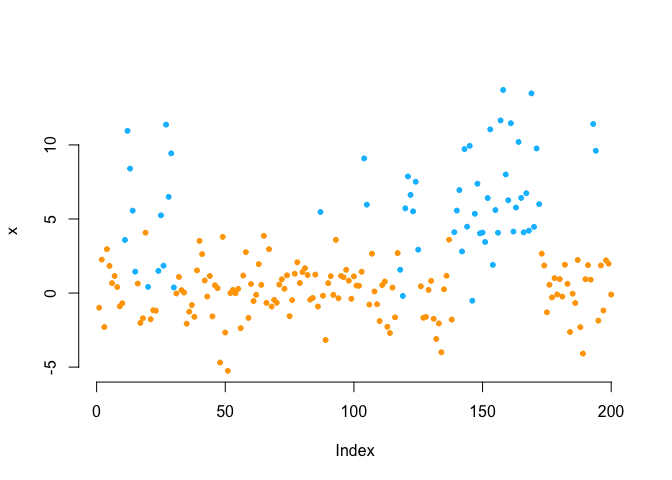

# {Lcpp}: Forward algorithm in C++ 

This package contains convenient **R** wrapper functions for the
**forward algorithm** used to fit **hidden Markov models** (HMMs),
**hidden semi-Markov models** (HSMMs) and **state space models** (SSMs)
via **direct numerical maximum likelihood estimation**. The algorithm
calculates the log-likelihood recursively as a matrix product and uses a
scaling strategy to avoid numerical underflow (for details see [Zucchini
et
al. 2016](https://www.taylorfrancis.com/books/mono/10.1201/b20790/hidden-markov-models-time-series-walter-zucchini-iain-macdonald-roland-langrock)).
Implementation in **C++** offers 10-20 times faster evaluation times,
thus substantially speeding up estimation by e.g. `nlm()` or `optim()`.
Current implementations include

- `forward()` for models with **homogeneous** transition probabilities,
- `forward_g()` for general (pre-calculated) **inhomogeneous**
  transition probabilities (including **continuous-time** HMMs), and
- `forward_p()` which is more efficient than the general implementation,
  when transition probabilities only vary **periodically**.

The functions are built to be included in the negative log-likelihood
function, after parameters have been transformed and the *allprobs*
matrix (containing all state-dependent probabilities) has been
calculated.

The package also contains additional functions like `trigBasisExp()` for
efficient computation of trigonometric link functions and `semigroup()`
for fast calculation of transition matrices of continuous-time HMMs.

Further algorithm variations will be added as needed. Have fun!

## Installation

``` r
# install.packages("devtools")
devtools::install_github("janoleko/Lcpp")
```

## Example: Homogeneous HMM

#### Generating data from a 2-state HMM

``` r
# parameters
mu = c(0, 6)
sigma = c(2, 4)
Gamma = matrix(c(0.95, 0.05, 0.15, 0.85), nrow = 2, byrow = TRUE)
delta = c(0.5, 0.5)

# simulation
s = x = rep(NA, 2000)
s[1] = sample(1:2, 1, prob = delta)
x[1] = stats::rnorm(1, mu[s[1]], sigma[s[1]])
for(t in 2:2000){
  s[t] = sample(1:2, 1, prob = Gamma[s[t-1],])
  x[t] = stats::rnorm(1, mu[s[t]], sigma[s[t]])
}

plot(x[1:400], bty = "n", pch = 20, ylab = "x", col = c("orange", "deepskyblue")[s[1:400]])
```



#### Writing the negative log-likelihood function

Here we use the package functionality in the last line

``` r
mllk = function(theta.star, x){
  # parameter transformations for unconstraint optimization
  Gamma = diag(2)
  Gamma[!Gamma] = exp(theta.star[1:2])
  Gamma = Gamma / rowSums(Gamma)
  delta = solve(t(diag(2)-Gamma+1), rep(1,2)) # stationary HMM
  mu = theta.star[3:4]
  sigma = exp(theta.star[5:6])
  # calculate all state-dependent probabilities
  allprobs = matrix(1, length(x), 2)
  for(j in 1:2){ allprobs[,j] = stats::dnorm(x, mu[j], sigma[j]) }
  # return negative for minimization
  -Lcpp::forward(delta, Gamma, allprobs)
}
```

#### Fitting an HMM to the data

``` r
theta.star = c(-2,-2,0,5,log(2),log(3)) # initial transformed parameters
s = Sys.time()
mod = stats::nlm(mllk, theta.star, x = x)
Sys.time()-s
#> Time difference of 0.07219005 secs
```

Really fast!

#### Visualizing results

``` r
# transform parameters to working
Gamma = diag(2)
Gamma[!Gamma] = exp(mod$estimate[1:2])
Gamma = Gamma / rowSums(Gamma)
delta = solve(t(diag(2)-Gamma+1), rep(1,2)) # stationary HMM
mu = mod$estimate[3:4]
sigma = exp(mod$estimate[5:6])

hist(x, prob = TRUE, bor = "white", breaks = 40, main = "")
curve(delta[1]*dnorm(x, mu[1], sigma[1]), add = TRUE, lwd = 2, col = "orange", n=500)
curve(delta[2]*dnorm(x, mu[2], sigma[2]), add = TRUE, lwd = 2, col = "deepskyblue", n=500)
curve(delta[1]*dnorm(x, mu[1], sigma[1])+delta[2]*dnorm(x, mu[2], sigma[2]),
      add = TRUE, lwd = 2, lty = "dashed", n=500)
legend("topright", col = c("orange", "deepskyblue", "black"), lwd = 2, bty = "n",
       lty = c(1,1,2), legend = c("state 1", "state 2", "marginal"))
```


