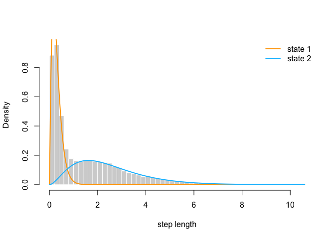

# LaMa 

<!-- badges: start -->

[](https://CRAN.R-project.org/package=LaMa)
[](https://cran.r-project.org/package=LaMa)
[](https://github.com/janoleko/LaMa/actions/workflows/R-CMD-check.yaml)
<!-- badges: end -->

A variety of latent Markov models, including **hidden Markov models**
(HMMs), **hidden semi-Markov models** (HSMMs), **state space models**
(SSMs) and **continuous-time** variants can be formulated and estimated
within the same framework via directly maximizing the (approximate)
likelihood using the so-called **forward algorithm** (for details see
<a href="https://www.taylorfrancis.com/books/mono/10.1201/b20790/hidden-markov-models-time-series-walter-zucchini-iain-macdonald-roland-langrock" target="_blank">Zucchini
et al. 2016</a>). Applied researchers often need custom models that
standard software does not easily support. Writing tailored `R` code
offers flexibility but suffers from slow estimation speeds. This `R`
package solves these issues by providing easy-to-use functions (written
in C++ for speed) for common tasks like the forward algorithm. These
functions can be combined into custom models, offering up to 10-20 times
faster estimation via standard numerical optimizers like `nlminb()` or
`optim()`. The development version now also allows for automatic
differentiation with the `RTMB` package which drastically increases
speed and accuracy.

The most important implementations of the forward algorithm are:

- `forward()` for models with **homogeneous** transition probabilities,
  and
- `forward_g()` for general (pre-calculated) **inhomogeneous**
  transition probabilities (including **continuous-time** HMMs and
  points processes)

The functions are built to be included in the **negative log-likelihood
function**, after parameters have been transformed and the `allprobs`
matrix (containing all state-dependent probabilities) has been
calculated.

To serve as a powerful toolbox, this package also includes many
auxiliary functions like

- the `tpm` family with for calculating transition probability matrices,
  <!-- + `tpm()` for calculating a homogeneous transition probability matrix via the multinomial logistic link,  -->
  <!-- + `tpm_g()` for calculating general inhomogeneous transition probabilty matrices,  -->
  <!-- + `tpm_p()` for calculating transition matrices of periodically inhomogeneous HMMs, -->
  <!-- + `tpm_cont()` for calculating the transition probabilites of a continuous-time Markov chain, -->
  <!-- + `tpm_emb()` for calculating the embedded transition matrix of an HSMM, -->

- the `stationary` family to compute stationary and periodically
  stationary distributions

- as well as the `stateprobs` and `viterbi` family for local and global
  decoding.

## Installation

You can install the released package version from
[CRAN](https://CRAN.R-project.org) with:

``` r
install.packages("LaMa")
```

or the development version from Github:

``` r
# install.packages("devtools")
devtools::install_github("janoleko/LaMa")
```

<!-- (To install from Github, you need a functional <a href="https://teuder.github.io/rcpp4everyone_en/020_install.html" target="_blank">C++ compiler</a>.) -->

## Package documentation

To aid in building fully custom likelihood functions, this package
contains several vignettes that demonstrate how to simulate data from
and estimate a wide range of models using the functions included in this
package:

- [Introduction to
  LaMa](https://janoleko.github.io/files/vignettes/LaMa/Intro_to_LaMa.pdf)
- [Inhomogeneous HMMs with covariate
  effects](https://janoleko.github.io/files/vignettes/LaMa/Inhomogeneous_HMMs.pdf)
- [Longitudinal
  data](https://janoleko.github.io/files/vignettes/LaMa/Longitudinal_data.pdf)
- [Periodic
  HMMs](https://janoleko.github.io/files/vignettes/LaMa/Periodic_HMM.pdf)
- [State space
  models](https://janoleko.github.io/files/vignettes/LaMa/State_space_models.pdf)
- [Continuous-time
  HMMs](https://janoleko.github.io/files/vignettes/LaMa/Continuous_time_HMMs.pdf)
- [Hidden semi-Markov
  models](https://janoleko.github.io/files/vignettes/LaMa/HSMMs.pdf)
- [Markov-modulated (marked) Poisson
  processes](https://janoleko.github.io/files/vignettes/LaMa/MMMPPs.pdf)
- [LaMa and
  RTMB](https://janoleko.github.io/files/vignettes/LaMa/LaMa%20and%20RTMB.html)

## Citation

When using LaMa, please cite the package as follows:

``` r
citation(package = "LaMa")
#> Warning in citation(package = "LaMa"): could not determine year for 'LaMa' from
#> package DESCRIPTION file
#> To cite package 'LaMa' in publications use:
#> 
#>   Koslik J (????). _LaMa: Fast Numerical Maximum Likelihood Estimation
#>   for Latent Markov Models_. R package version 2.0.0,
#>   https://github.com/janoleko/LaMa,
#>   <https://janoleko.github.io/software/>.
#> 
#> A BibTeX entry for LaTeX users is
#> 
#>   @Manual{,
#>     title = {LaMa: Fast Numerical Maximum Likelihood Estimation for Latent Markov Models},
#>     author = {Jan-Ole Koslik},
#>     note = {R package version 2.0.0, https://github.com/janoleko/LaMa},
#>     url = {https://janoleko.github.io/software/},
#>   }
```

## Introductory example: Homogeneous HMM

#### Loading the package

``` r
library(LaMa)
#> Loading required package: RTMB
```

#### Generating data from a 2-state HMM

Here we can use `stationary()` to compute the stationary distribution.

``` r
# parameters
mu = c(0, 6)
sigma = c(2, 4)
Gamma = matrix(c(0.95, 0.05, 0.15, 0.85), nrow = 2, byrow = TRUE)
delta = stationary(Gamma) # stationary HMM

# simulation
n = 10000 # rather large
set.seed(123)
s = x = rep(NA, n)
s[1] = sample(1:2, 1, prob = delta)
for(t in 2:n){
  s[t] = sample(1:2, 1, prob = Gamma[s[t-1],])
}
x = rnorm(n, mu[s], sigma[s])
plot(x[1:200], bty = "n", pch = 20, ylab = "x", 
     col = c("orange","deepskyblue")[s[1:200]])
```


#### Writing the negative log-likelihood function

Here, we build the transition probability matrix using the `tpm()`
function, compute the stationary distribution using `stationary()` and
calculate the log-likelihood using `forward()` in the last line.

``` r
nll = function(theta.star, x){
  # parameter transformations for unconstraint optimization
  Gamma = tpm(theta.star[1:2])
  delta = stationary(Gamma) # stationary HMM
  mu = theta.star[3:4]
  sigma = exp(theta.star[5:6])
  # calculate all state-dependent probabilities
  allprobs = matrix(1, length(x), 2)
  for(j in 1:2){ allprobs[,j] = dnorm(x, mu[j], sigma[j]) }
  # return negative for minimization
  -forward(delta, Gamma, allprobs)
}
```

#### Fitting an HMM to the data

``` r
theta.star = c(-1,-1,1,4,log(1),log(3)) 
# initial transformed parameters: not chosen too well
system.time(
  mod <- nlm(nll, theta.star, x = x)
)
#>    user  system elapsed 
#>   0.132   0.008   0.141
```

Really fast for 10.000 data points!

#### Visualizing results

Again, we use `tpm()` and `stationary()` to tranform the unconstraint
parameters to working parameters.

``` r
# transform parameters to working
Gamma = tpm(mod$estimate[1:2])
delta = stationary(Gamma) # stationary HMM
mu = mod$estimate[3:4]
sigma = exp(mod$estimate[5:6])

hist(x, prob = TRUE, bor = "white", breaks = 40, main = "")
curve(delta[1]*dnorm(x, mu[1], sigma[1]), add = TRUE, lwd = 2, col = "orange", n=500)
curve(delta[2]*dnorm(x, mu[2], sigma[2]), add = TRUE, lwd = 2, col = "deepskyblue", n=500)
curve(delta[1]*dnorm(x, mu[1], sigma[1])+delta[2]*dnorm(x, mu[2], sigma[2]),
      add = TRUE, lwd = 2, lty = "dashed", n=500)
legend("topright", col = c("orange", "deepskyblue", "black"), lwd = 2, bty = "n",
       lty = c(1,1,2), legend = c("state 1", "state 2", "marginal"))
```


