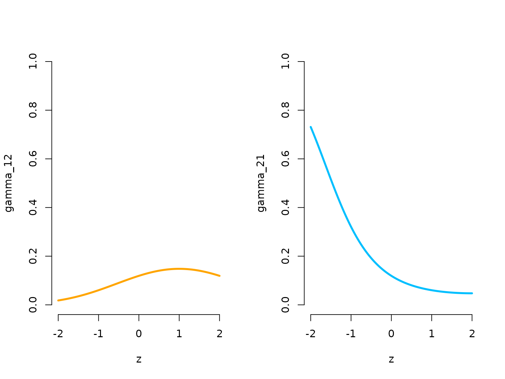
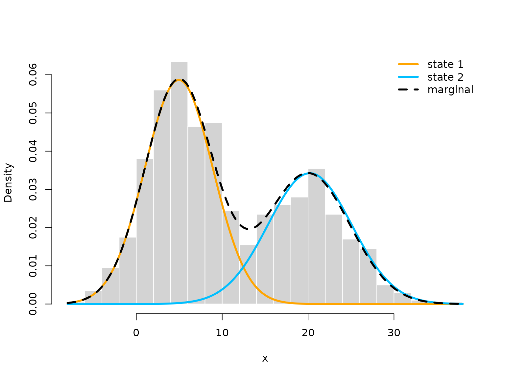
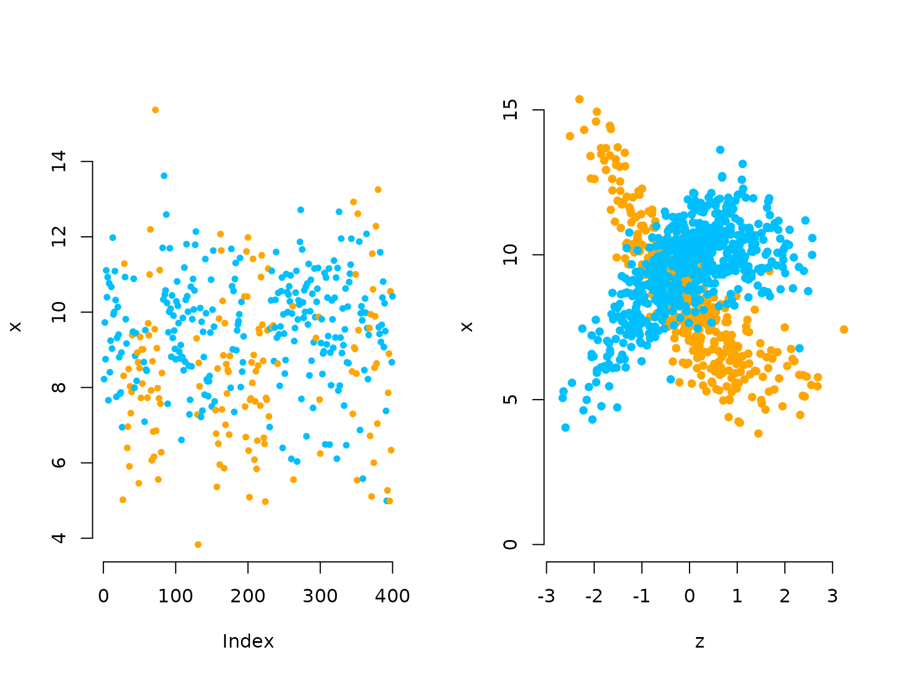

# Inhomogeneous HMMs

> Before diving into this vignette, we recommend reading the vignette
> [**Introduction to
> LaMa**](https://janoleko.github.io/LaMa/articles/Intro_to_LaMa.html).

This vignette explains how to fit inhomogeneous HMMs, i.e. models that
depend on external covariates with `LaMa`. Such inhomogeneity in HMMs
can result from covariates affecting the transition probabilities of the
underlying Markov chain, or covariates affecting the state-dependent
distributions, which would then be called Markov-switching regression.
We will begin with effects in the state process

## Covariate effects in the state process

If covariates affect the transition probabilities, this implies that we
model the transition probability matrix as a function of said
covariates. Let z_t be a vector of covariates of length p+1 for t = 1,
\dots, T, where the first entry is always equal to 1 to include an
intercept. Moreover, let \beta\_{ij} be a vector of regression
parameters, also of length p+1 for each off-diagonal element (i \neq j)
of the transition probability matrix. First, consider linear predictors
\eta\_{ij}^{(t)} = \beta\_{ij}^{'} z_t, for t = 1, \dots, T. As the
transition probabilities need to be in lie in the interval (0,1) and
each row of the transition matrix needs to sum to one, we obtain the
transition probabilities via the inverse multinomial logistic link as
\gamma\_{ij}^{(t)} = \Pr(S_t = j \mid S\_{t-1} = i) =
\frac{\exp(\eta\_{ij}^{(t)})}{\sum\_{k=1}^N \exp(\eta\_{ik}^{(t)})},
where \eta\_{ii} is set to zero for i = 1, \dots, N for identifiability
and N is the number of hidden states. The function
[`tpm_g()`](https://janoleko.github.io/reference/tpm_g.md) conducts this
calculation for all elements of the t.p.m. and all time points
efficiently in C++.

At this point we want to point out that the definition of the transition
probabilities is not necessarily unique. Indeed for data points at times
1, \dots, T we only need T-1 transition probability matrices. The
definition above means that the transition probability between t-1 and t
depends on the covariate values at time point t, but we could also have
defined \gamma\_{ij}^{(t)} = \Pr(S\_{t+1} = j \mid S_t = i). We want to
point out that these two specifications are **not** equivalent. For HMMs
there is no established convention, so this choice needs to be made by
users and can be important when the exact timing of the covariate effect
is relevant. In `LaMa` this comes down to either passing the design
matrix excluding its first or last row to
[`tpm_g()`](https://janoleko.github.io/reference/tpm_g.md), where we use
the first option in this vignette. If you forget to exclude the first or
the last row of the design matrix when calculating all transition
matrices, and pass an array of dimension `c(N,N,T)` to
[`forward_g()`](https://janoleko.github.io/reference/forward_g.md) for
likelihood evaluation, the function will revert to the first option by
just ignoring the first slice of the array.

### Simulation example

We begin by simulating data from the above specified model, assuming 2
states and Gaussian state-dependent distributions. The covariate effects
for the state process are fully specified by a parameter matrix `beta`
of dimension `c(N*(N-1), p+1)`. By default the function
[`tpm_g()`](https://janoleko.github.io/reference/tpm_g.md) will fill the
off-diagonal elements of each transition matrix by column, which can be
changed by setting `byrow = TRUE`. The latter is useful, as popular HMM
packages like `moveHMM` or `momentuHMM` return the parameter matrix such
that the t.p.m. needs to be filled by row.

``` r
# loading the package
library(LaMa)
#> Loading required package: RTMB
```

``` r
# parameters
mu = c(5, 20)   # state-dependent means
sigma = c(4, 5) # state-dependent standard deviations

# state process regression parameters
beta = matrix(c(-2, -2,       # intercepts
                -1, 0.5,      # linear effects
                0.25, -0.25), # quadratic effects
              nrow = 2)

n = 1000 # number of observations
set.seed(123)
z = rnorm(n) # in practice there will be n covariate values.
# However, we only have n-1 transitions, thererfore we only need n-1 values:
Z = cbind(z, z^2) # quadratic effect of z
Gamma = tpm_g(Z = Z[-1,], beta) # of dimension c(2, 2, n-1)
delta = c(0.5, 0.5) # non-stationary initial distribution

color = c("orange", "deepskyblue")

oldpar = par(mfrow = c(1,2))
zseq = seq(-2,2,by = 0.01)
Gamma_seq = tpm_g(Z = cbind(zseq, zseq^2), beta)
plot(zseq, Gamma_seq[1,2,], type = "l", lwd = 3, bty = "n", ylim = c(0,1), 
     xlab = "z", ylab = "gamma_12", col = color[1])
plot(zseq, Gamma_seq[2,1,], type = "l", lwd = 3, bty = "n", ylim = c(0,1),
     xlab = "z", ylab = "gamma_21", col = color[2])
```



``` r
par(oldpar)
```

Let’s now simulate synthetic data from the above specified model.

``` r
s = rep(NA, n)
s[1] = sample(1:2, 1, prob = delta) # sampling first state from initial distr.
for(t in 2:n){
  # sampling next state conditional on previous one with tpm at that time point
  s[t] = sample(1:2, 1, prob = Gamma[s[t-1],,t-1])
}
# sampling observations conditional on the states
x = rnorm(n, mu[s], sigma[s])

plot(x[1:200], bty = "n", pch = 20, ylab = "x", 
     col = c(color[1], color[2])[s[1:200]])
```


We now model the transition probabilities parametrically, where we have
a paramter for the intercept, the linear effect and the quadratic effect
for each off-diagonal element of the t.p.m.

### Writing the negative log-likelihood function

Here we specify the likelihood function and pretend we know the
polynomial degree of the effect of z on the transition probabilities.

``` r
nll = function(par, x, Z){
  beta = matrix(par[1:6], nrow = 2) # matrix of coefficients
  Gamma = tpm_g(Z[-1,], beta) # excluding the first covariate value -> n-1 tpms
  delta = c(1, exp(par[7]))
  delta = delta / sum(delta)
  mu = par[8:9]
  sigma = exp(par[10:11])
  # calculate all state-dependent probabilities
  allprobs = matrix(1, length(x), 2)
  for(j in 1:2) allprobs[,j] = dnorm(x, mu[j], sigma[j])
  # forward algorithm
  -forward_g(delta, Gamma, allprobs)
}
```

### Fitting an HMM to the data

``` r
par = c(beta = c(-2, -2, rep(0,4)), # initialising with homogeneous tpm
        logitdelta = 0, # starting value for initial distribution
        mu = c(4, 14), # initial state-dependent means
        sigma = c(log(3),log(5))) # initial state-dependents sds
system.time(
  mod <- nlm(nll, par, x = x, Z = Z)

)
#>    user  system elapsed 
#>   0.788   0.018   0.806
```

Really fast!

### Visualising results

Again, we use [`tpm_g()`](https://janoleko.github.io/reference/tpm_g.md)
and [`stationary()`](https://janoleko.github.io/reference/stationary.md)
to tranform the parameters.

``` r
# transform parameters to working
beta_hat = matrix(mod$estimate[1:6], nrow = 2)
Gamma_hat = tpm_g(Z = Z[-1,], beta_hat)
delta_hat = c(1, exp(mod$estimate[7]))
delta_hat = delta_hat / sum(delta_hat)
mu_hat = mod$estimate[8:9]
sigma_hat = exp(mod$estimate[10:11])

# we calculate the average state distribution overall all covariate values
zseq = seq(-2, 2, by = 0.01)
Gamma_seq = tpm_g(Z = cbind(zseq, zseq^2), beta_hat)
Prob = matrix(nrow = length(zseq), ncol = 2)
for(i in 1:length(zseq)){ Prob[i,] = stationary(Gamma_seq[,,i]) }
prob = apply(Prob, 2, mean)

hist(x, prob = TRUE, bor = "white", breaks = 20, main = "")
curve(prob[1]*dnorm(x, mu_hat[1], sigma_hat[1]), add = TRUE, lwd = 3, 
      col = color[1], n=500)
curve(prob[2]*dnorm(x, mu_hat[2], sigma_hat[2]), add = TRUE, lwd = 3, 
      col = color[2], n=500)
curve(prob[1]*dnorm(x, mu_hat[1], sigma_hat[1])+
        prob[2]*dnorm(x, mu[2], sigma_hat[2]),
      add = TRUE, lwd = 3, lty = "dashed", n = 500)
legend("topright", col = c(color[1], color[2], "black"), lwd = 3, bty = "n",
       lty = c(1,1,2), legend = c("state 1", "state 2", "marginal"))
```



``` r

oldpar = par(mfrow = c(1,2))
plot(zseq, Gamma_seq[1,2,], type = "l", lwd = 3, bty = "n", ylim = c(0,1), 
     xlab = "z", ylab = "gamma_12_hat", col = color[1])
plot(zseq, Gamma_seq[2,1,], type = "l", lwd = 3, bty = "n", ylim = c(0,1),
     xlab = "z", ylab = "gamma_21_hat", col = color[2])
```


``` r
par(mfrow = c(1,1))
plot(zseq, Prob[,1], type = "l", lwd = 3, bty = "n", ylim = c(0,1), xlab = "z", 
     ylab = "Pr(state 1)", col = color[1])
```


``` r
par(oldpar)
```

## Covariate effects in the state-dependent process

We now look at a setting where covariates influence the mean of the
state-dependent distribution, while the state switching is controlled by
a homogeneous Markov chain. This is often called **Markov-switching
regression**. Assuming the observation process to be conditionally
normally distributed, this means

X_t \mid S_t = j \sim N(\beta_j^{'} z_t, \\ \sigma_j^2), \quad j = 1,
\dots, N.

### Simulation example

First we specify parameters for the simulation. The important change
here is that `beta` now contains the regression coefficients for the
state-dependent regressions.

``` r
sigma = c(1, 1) # state-dependent standard deviations (homoscedasticity)

# parameter matrix
# each row contains parameter vector for the corresponding state
beta = matrix(c(8, 10,             # intercepts
                -2, 1, 0.5, -0.5), # slopes
              nrow = 2)
n = 1000 # number of observations
set.seed(123)
z = rnorm(n)
Z = cbind(z, z^2) # quadratic effect of z

Gamma = matrix(c(0.9, 0.1, 0.05, 0.95), 
               nrow = 2, byrow = TRUE) # homogeneous t.p.m.
delta = stationary(Gamma) # stationary Markov chain
```

### Simulation

In the simulation code, the state-dependent mean now is not fixed
anymore, but changes accoring to the covariate values in `Z`.

``` r
s = x = rep(NA, n)
s[1] = sample(1:2, 1, prob = delta)
x[1] = rnorm(1, beta[s[1],]%*%c(1, Z[1,]), # state-dependent regression
                    sigma[s[1]])
for(t in 2:n){
  s[t] = sample(1:2, 1, prob = Gamma[s[t-1],])
  x[t] = rnorm(1, beta[s[t],]%*%c(1, Z[t,]), # state-dependent regression
                      sigma[s[t]])
}

oldpar = par(mfrow = c(1,2))
plot(x[1:400], bty = "n", pch = 20, ylab = "x", 
     col = c(color[1], color[2])[s[1:400]])

plot(z[which(s==1)], x[which(s==1)], pch = 16, col = color[1], bty = "n", 
     ylim = c(0,15), xlab = "z", ylab = "x")
points(z[which(s==2)], x[which(s==2)], pch = 16, col = color[2])
```



``` r
par(oldpar)
```

### Writing the negative log-likelihood function

In the likelihood function, we also add the state-dependent regression
in the loop calculating the state-dependent probabilities. The code
`cbind(1,Z) %*% beta[j,]` computes the linear predictor for the j-th
state.

``` r
nllMSR = function(par, x, Z){
  Gamma = tpm(par[1:2]) # homogeneous tpm
  delta = stationary(Gamma) # stationary Markov chain
  beta = matrix(par[2 + 1:(2 + 2*2)], nrow = 2) # parameter matrix
  sigma = exp(par[2 + 2 + 2*2 + 1:2])
  # calculate all state-dependent probabilities
  allprobs = matrix(1, length(x), 2)
  # state-dependent regression
  for(j in 1:2) allprobs[,j] = dnorm(x, cbind(1,Z) %*% beta[j,], sigma[j])
  # forward algorithm
  -forward(delta, Gamma, allprobs)
}
```

### Fitting a Markov-switching regression model

``` r
par = c(logitgamma = c(-2, -3),      # starting values state process
        beta = c(8, 10, rep(0,4)),   # starting values for regression
        logsigma = c(log(1),log(1))) # starting values for sigma
system.time(
  mod_reg <- nlm(nllMSR, par, x = x, Z = Z)
)
#>    user  system elapsed 
#>   0.275   0.024   0.299
```

### Visualising results

To visualise the results, be transform the parameters to working
parameters and add the two estimated state-specific regressions to the
scatter plot.

``` r
Gamma_hat_reg = tpm(mod_reg$estimate[1:2]) # calculating all tpms
delta_hat_reg = stationary(Gamma_hat_reg)
beta_hat_reg = matrix(mod_reg$estimate[2+1:(2*2+2)], nrow = 2)
sigma_hat_reg = exp(mod_reg$estimate[2+2*2+2 +1:2])

# we have some label switching
plot(z, x, pch = 16, bty = "n", xlab = "z", ylab = "x", col = color[s])
points(z, x, pch = 20)
curve(beta_hat_reg[1,1] + beta_hat_reg[1,2]*x + beta_hat_reg[1,3]*x^2, 
      add = TRUE, lwd = 4, col = color[2])
curve(beta_hat_reg[2,1] + beta_hat_reg[2,2]*x + beta_hat_reg[2,3]*x^2, 
      add = TRUE, lwd = 4, col = color[1])
```


> Continue reading with [**Periodic
> HMMs**](https://janoleko.github.io/LaMa/articles/Periodic_HMMs.html),
> [**LaMa and
> RTMB**](https://janoleko.github.io/LaMa/articles/LaMa_and_RTMB.html),
> or [**Penalised
> splines**](https://janoleko.github.io/LaMa/articles/Penalised_splines.html).
