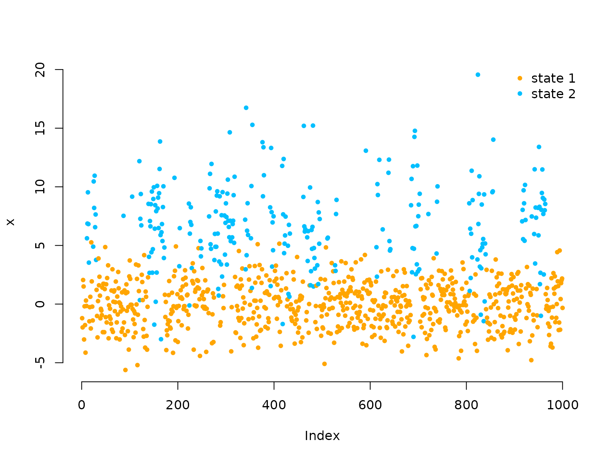
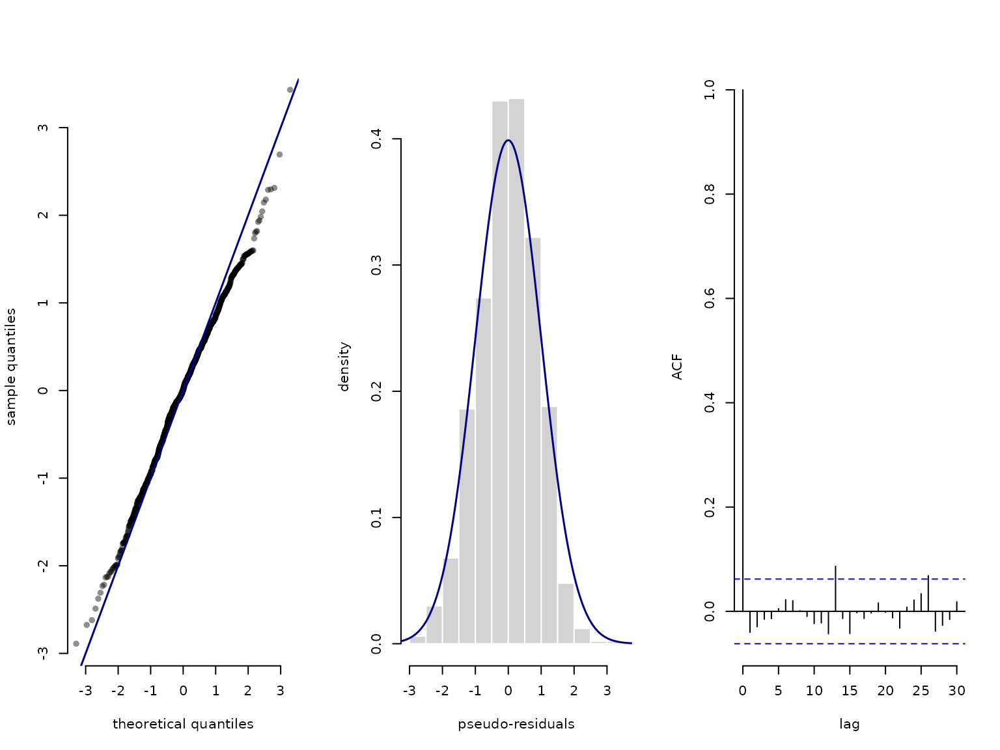

# Introduction to LaMa

The `R` package `LaMa` provides convenient functions for fitting a
variety of **latent Markov models** ([Mews, Koslik, and Langrock
2025](#ref-mews2024build)), including **hidden Markov models** (HMMs),
**hidden semi-Markov models** (HSMMs), **state space models** (SSMs) and
**continuous-time** variants via **direct numerical maximum likelihood
estimation**. The core idea is that the user defines their own negative
log-likelihood function for numerical optimisation, but can rely on
package functions for convenience and speed.

The main families of functions are `forward`, `tpm` and `stationary` and
we showcase the simplest versions in the following introductory example.

## Introductory example: Homogeneous HMM

In this vignette, we start from the most simple HMM we can think of.
Such a basic N-state HMM is a doubly stochastic process in discrete
time. Observations are generated by one of N possible distributions
f_j(x_t), j = 1, \dots N with an unobserved **N-state Markov chain**
selecting which distribution is active at any given time point. Hence,
HMMs can be interpreted as temporally dependent mixture models and are
very popular across a wide range of disciplines like ecology, sports and
finance where time-series data with underlying sequential dependencies
are to be analysed. They statements above already hint at the two main
assumptions in such a model, namely

1.  f(s_t \mid s\_{t-1}, s\_{t-2}, \dots, s_1) = f(s_t \mid s\_{t-1})
    (Markov assumption)
2.  f(x_t \mid x_1, \dots, x\_{t-1}, x\_{t-1}, x_T, s_1, \dots, s_T) =
    f(x_t \mid s_t) (conditional independence assumption).

The hidden state process is described by a Markov chain, as such a
stochastic process can easily be characterised by its **initial
distribution** \delta^{(1)} = (\Pr(S_1 = 1), \dots, \Pr(S_1 = N)) and
the one-step **transition probabilities** \gamma\_{ij} = \Pr(S_t = j
\mid S\_{t-1} = i), \quad i,j = 1, \dotsc, N which are typically
summarised in the so-called **transition probability matrix** (t.p.m.)
\Gamma = (\gamma\_{ij})\_{i,j = 1, \dots, N} where row i is the
conditional one-step ahead distribution of the state process given that
the current state is i. Such a matrix is most-conveniently parameterised
by an unconstrained parameter vector for the N (N-1) off-diagonal
elements. Each row can then be computed via the inverse multinomial
logistic link (also known as softmax). This can be done using the
function [`tpm()`](https://janoleko.github.io/reference/tpm.md):

``` r
(Gamma = tpm(c(-2, -3))) # 2 states -> 2*(1-2) = 2 off-diagonal entries
#>           S1         S2
#> S1 0.9525741 0.04742587
#> S2 0.1192029 0.88079708
```

For HMMs with such homogeneous transition probabilities, we often assume
**stationarity** of the underlying Markov chain, as well-behaved Markov
chains converge to a unique stationary distribution. When we
e.g. observe an animal and model its behavioral states by a Markov
chain, it is reasonable to assume that the chain has been running for a
long time prior to our observation and thus already converged to its
stationary distribution. This distribution (which we call \delta) can be
computed by solving the system of equations \delta \Gamma = \delta,
\quad \text{s.t.} \\ \sum\_{j=1}^N \delta_j = 1, which is implemented in
the function
[`stationary()`](https://janoleko.github.io/reference/stationary.md).
For stationary HMMs, we then replace the initial distribution
\delta^{(1)} by this stationary distribution. We can easily compute the
stationary distribution associated with the above t.p.m. using

``` r
(delta = stationary(Gamma))
#>        S1        S2 
#> 0.7153801 0.2846199
```

This stationary distribution can be interpreted as the log-run-time
proportion of time spent in each state.

For the conditional distributions of the observations f_j(x_t), a
typical choice would be some kind of parametric family like normal or
gamma distributions with state-specific means and standard deviations.
For a more exhaustive description of such models see Zucchini,
MacDonald, and Langrock ([2016](#ref-zucchini)).

### Generating data from a 2-state HMM

We start by simulating some data from a simple 2-state HMM with Gaussian
state-dependent distributions, to get some intuition. Here we can again
use [`stationary()`](https://janoleko.github.io/reference/stationary.md)
to compute the stationary distribution.

``` r
# parameters
mu = c(0, 6)    # state-dependent means
sigma = c(2, 4) # state-dependent standard deviations
Gamma = matrix(c(0.95, 0.05, 0.15, 0.85), # transition probability matrix
               nrow = 2, byrow = TRUE)
delta = stationary(Gamma) # stationary distribution

# simulation
n = 1000
set.seed(123)
s = rep(NA, n)
s[1] = sample(1:2, 1, prob = delta) # sampling first state from delta
for(t in 2:n){
  # drawing the next state conditional on the last one
  s[t] = sample(1:2, 1, prob = Gamma[s[t-1],]) 
}
# drawing the observation conditional on the states
x = rnorm(n, mu[s], sigma[s])

color = c("orange", "deepskyblue")
plot(x[1:200], bty = "n", pch = 20, ylab = "x", 
     col = color[s[1:200]])
```


### Inference by direct numerical maximum likelihood estimation

Inference for HMMs is more difficult compared to e.g. regression
modelling as the observations are not independent. We want to estimate
model parameters via maximum likelihood estimation, due to the nice
properties possessed by the maximum likelihood estimator. However,
computing the HMM likelihood for observed data points x_1, \dots, x_T is
a non-trivial task as we do not observe the underlying states. We thus
need to *sum out* all possible state sequences which would be infeasible
for general state processes. We can, however, exploit the Markov
property and thus calculate the likelihood recursively as a matrix
product using the so-called **forward algorithm**. In closed form, the
HMM likelihood then becomes

L(\theta) = \delta^{(1)} P(x_1) \Gamma P(x_2) \Gamma \dots \Gamma P(x_T)
1^t, where \delta^{(1)} and \Gamma are as defined above, P(x_t) is a
diagonal matrix with state-dependent densities or probability mass
functions f_j(x_t) = f(x_t \mid S_t = j) on its diagonal and 1 is a row
vector of ones with length N. All model parameters are here summarised
in the vector \theta. Being able to evaluate the likelihood function, it
can be numerically maximised by popular optimisers like
[`nlm()`](https://rdrr.io/r/stats/nlm.html) or
[`optim()`](https://rdrr.io/r/stats/optim.html).

The algorithm explained above suffers from numerical underflow and for T
only moderately large the likelihood is rounded to zero. Thus, one can
use a scaling strategy, detailed by Zucchini, MacDonald, and Langrock
([2016](#ref-zucchini)), to avoid this and calculate the log-likelihood
recursively. This version of the forward algorithm is implemented in
`LaMa` and written in C++.

Additionally, for HMMs we often need to constrain the domains of several
of the model parameters in \theta (i.e. positive standard deviations or
a transition probability matrix with elements between 0 and 1 and rows
that sum to one). One could now resort to constrained numerical
optimisation but in practice the better option is to maximise the
likelihood w.r.t. a transformed version (to the real number line) of the
model parameters by using suitable invertible and differentiable link
functions (denoted by `par` in the code). For example we use the
log-link for parameters that need to be strictly positive and the
multinomial logistic link for the transition probability matrix. While
the former can easily be coded by hand, the latter is implemented in the
functions of the `tpm` family for convenience and computational speed.

For efficiency, it is also advisable to evaluate the state-dependent
densities (or probability mass functions) vectorised outside the
recursive forward algorithm. This results in a matrix containing the
state-dependent likelihoods for each data point (rows), conditional on
each state (columns), which, throughout the package, we call the
`allprobs` matrix.

In this example, within the negative log-likelihood function we build
the homogeneous transition probability matrix using the
[`tpm()`](https://janoleko.github.io/reference/tpm.md) function and
compute the stationary distribution of the Markov chain using
[`stationary()`](https://janoleko.github.io/reference/stationary.md). We
then build the `allprobs` matrix and calculate the log-likelihood using
[`forward()`](https://janoleko.github.io/reference/forward.md) in the
last line. It is returned negative such that the function can be
numerically minimised by
e.g. [`nlm()`](https://rdrr.io/r/stats/nlm.html).

``` r
nll = function(par, x){
  # parameter transformations for unconstrained optimisation
  Gamma = tpm(par[1:2]) # multinomial logistic link
  delta = stationary(Gamma) # stationary initial distribution
  mu = par[3:4] # no transformation needed
  sigma = exp(par[5:6]) # strictly positive
  # calculating all state-dependent probabilities outside the forward algorithm
  allprobs = matrix(1, length(x), 2)
  for(j in 1:2) allprobs[,j] = dnorm(x, mu[j], sigma[j])
  # return negative for minimisation
  -forward(delta, Gamma, allprobs)
}
```

### Fitting an HMM to the data

``` r
par = c(logitGamma = qlogis(c(0.05, 0.05)),
        mu = c(1,4),
        logsigma = c(log(1),log(3)))
# initial transformed parameters: not chosen too well
system.time(
  mod <- nlm(nll, par, x = x)
)
#>    user  system elapsed 
#>   0.125   0.010   0.134
```

We see that implementation of the forward algorithm in C++ leads to
really fast estimation speeds.

### Visualising results

After model estimation, we need to retransform the unconstrained
parameters according to the code inside the likelihood:

``` r
# transform parameters to working
Gamma = tpm(mod$estimate[1:2])
delta = stationary(Gamma) # stationary HMM
mu = mod$estimate[3:4]
sigma = exp(mod$estimate[5:6])

hist(x, prob = TRUE, bor = "white", breaks = 40, main = "")
curve(delta[1]*dnorm(x, mu[1], sigma[1]), add = TRUE, lwd = 2, col = "orange", n=500)
curve(delta[2]*dnorm(x, mu[2], sigma[2]), add = TRUE, lwd = 2, col = "deepskyblue", n=500)
curve(delta[1]*dnorm(x, mu[1], sigma[1])+delta[2]*dnorm(x, mu[2], sigma[2]),
      add = TRUE, lwd = 2, lty = "dashed", n=500)
legend("topright", col = c(color, "black"), lwd = 2, bty = "n",
       lty = c(1,1,2), legend = c("state 1", "state 2", "marginal"))
```


We can also decode the most probable state sequence with the
[`viterbi()`](https://janoleko.github.io/reference/viterbi.md) function,
when first computing the `allprobs` matrix:

``` r
allprobs = matrix(1, length(x), 2)
for(j in 1:2) allprobs[,j] = dnorm(x, mu[j], sigma[j])

states = viterbi(delta, Gamma, allprobs)

plot(x, pch = 20, bty = "n", col = color[states])
legend("topright", pch = 20, legend = c("state 1", "state 2"), 
       col = color, box.lwd = 0)
```



Lastly, we can do some model checking using **pseudo-residuals**. First,
we need to compute the local state probabilities of our observations:

``` r
probs = stateprobs(delta, Gamma, allprobs)
```

Then, we can pass the observations, the state probabilities, the
parametric family and the estimated parameters to the
[`pseudo_res()`](https://janoleko.github.io/reference/pseudo_res.md)
function to get pseudo-residuals for model validation. These should be
standard normally distributed if the model is correct.

``` r
pres = pseudo_res(x, # observations
                  "norm", # parametric distribution to use
                  list(mean = mu, sd = sigma), # parameters for that distribution
                  probs) # local state probabilities

# use the plotting method for LaMaResiduals
plot(pres, hist = TRUE)
```



In this case, our model looks really good – as it should because we
simulated from the exact same model.

> Continue reading with [**LaMa and
> RTMB**](https://janoleko.github.io/LaMa/articles/LaMa_and_RTMB.html),
> [**Inhomogeneous
> HMMs**](https://janoleko.github.io/LaMa/articles/Inhomogeneous_HMMs.html),
> [**Periodic
> HMMs**](https://janoleko.github.io/LaMa/articles/Periodic_HMMs.html),
> [**Longitudinal
> data**](https://janoleko.github.io/LaMa/articles/Longitudinal_data.html),
> [**State-space
> models**](https://janoleko.github.io/LaMa/articles/State_space_models.html),
> [**Hidden semi-Markov
> models**](https://janoleko.github.io/LaMa/articles/HSMMs.html), or
> [**Continuous-time
> HMMs**](https://janoleko.github.io/LaMa/articles/Continuous_time_HMMs.html).

## References

Mews, Sina, Jan-Ole Koslik, and Roland Langrock. 2025. “How to Build
Your Latent Markov Model: The Role of Time and Space.” *Statistical
Modelling* 0 (0). <https://doi.org/10.1177/1471082X251355681>.

Zucchini, Walter, Iain L. MacDonald, and Roland Langrock. 2016. *Hidden
Markov Models for Time Series: An Introduction Using R*. Boca Raton:
Chapman & Hall/CRC.
