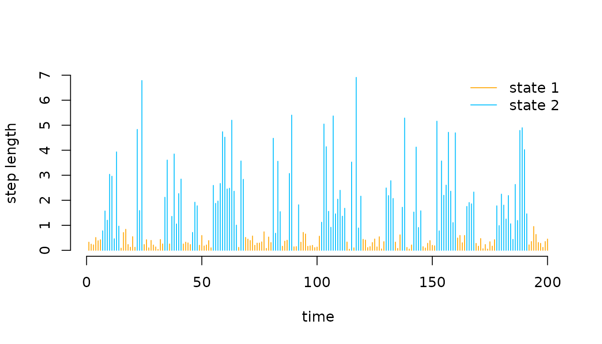
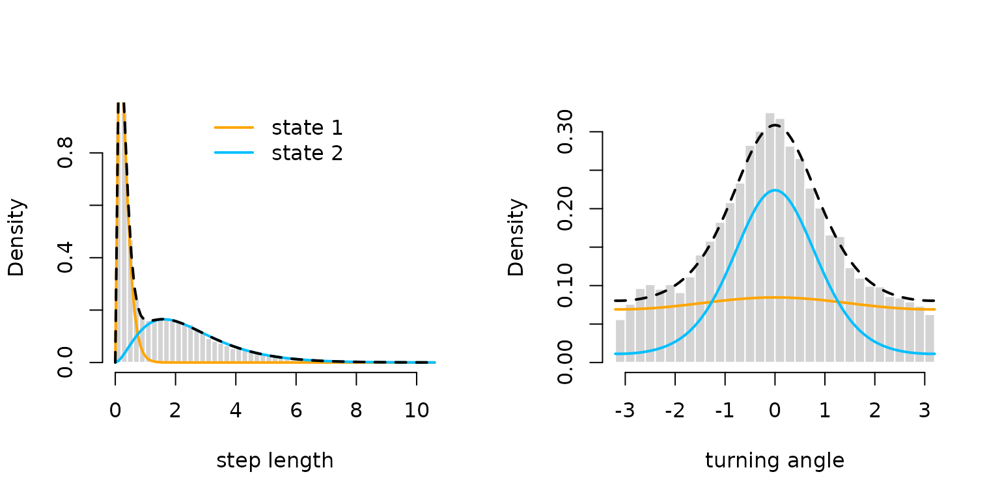
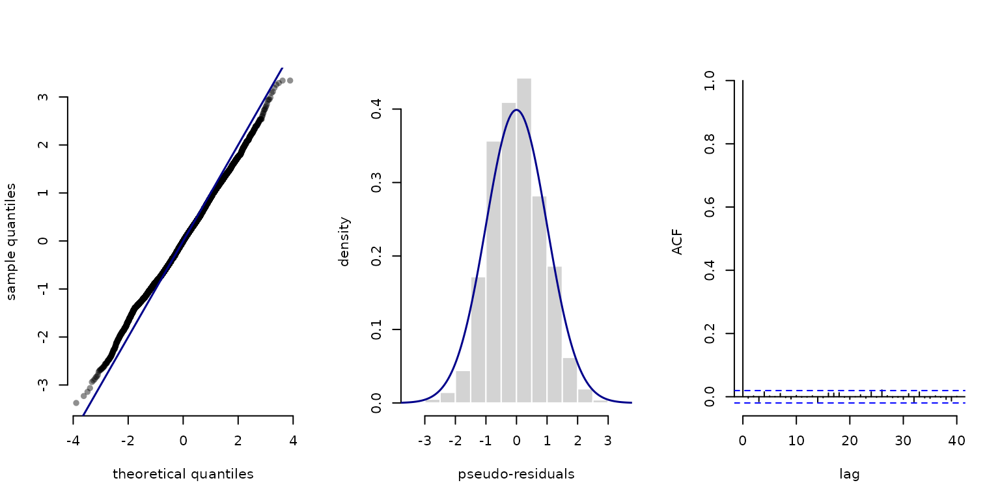
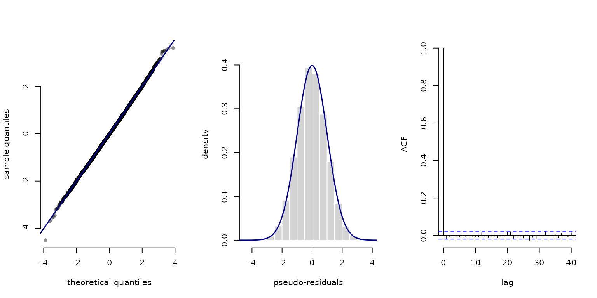
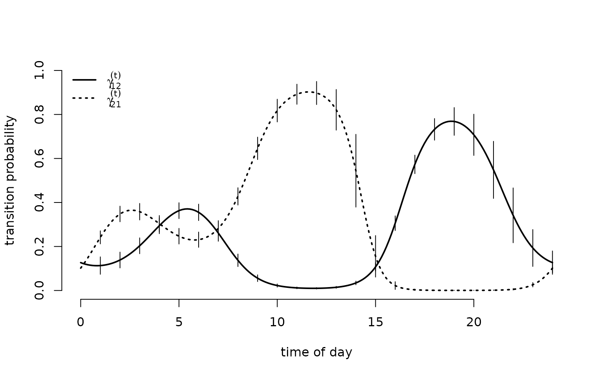
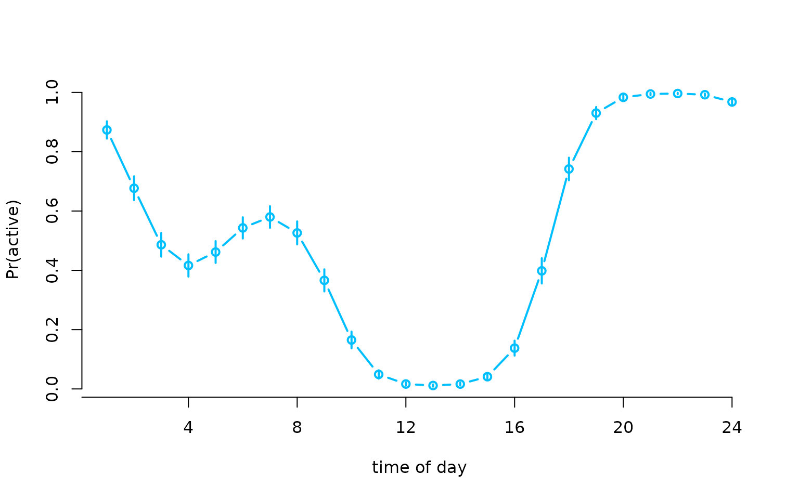

# LaMa and RTMB

> Before diving into this vignette, we recommend reading the vignettes
> [**Introduction to
> LaMa**](https://janoleko.github.io/LaMa/articles/Intro_to_LaMa.html),
> [**Inhomogeneous
> HMMs**](https://janoleko.github.io/LaMa/articles/Inhomogeneous_HMMs.html)
> and [**Periodic
> HMMs**](https://janoleko.github.io/LaMa/articles/Periodic_HMMs.html).

The recently introduced `R` package `RTMB` conveniently allows for
automatic differentiation for non-standard statistical models written in
plain `R` code. This enables the estimation of very complicated models,
potentially with complex random effect structures. The process feels
like magic because you have access to analytic gradients – *drastically*
increasing accuracy and speed – without doing any calculations!

`LaMa` is now also fully compatible with AD provided by `RTMB`. Hence,
estimation of latent Markov models is now faster and more convenient,
while model specification is very smooth and less prone to errors –
which at the current state tend to happen when one is not experienced
with `RTMB`.

Here we demonstrate how to use `LaMa` and `RTMB` to fit hidden Markov
models and their extensions. We start by loading the `LaMa` package,
which automatically loads `RTMB` as well.

``` r
library(LaMa)
```

For the purpose of this vignette, we will analyse the `trex` data set
contained in the package. It contains hourly step lengths of a
Tyrannosaurus rex, living 66 million years ago, and we aim to understand
its behavoural process using HMMs.

``` r
head(trex, 5)
#>   tod      step     angle state
#> 1   9 0.3252437        NA     1
#> 2  10 0.2458265  2.234562     1
#> 3  11 0.2173252 -2.262418     1
#> 4  12 0.5114665 -2.958732     1
#> 5  13 0.3828494  1.811840     1
```

### Basic workflow

The workflow with `RTMB` is basically always the same. We need to

- define the negative log-likelihood function,
- create an automatically differentiable objective function from it and
- fit the model by numerical minimisation of the latter.

`RTMB` also provides many functions that make this process very
convenient.

### Simple HMM

We start by fitting a super simple stationary HMM with state-dependent
gamma distributions for the step lengths and von Mises distributions for
the turning angles. As a first step, we define the initial parameter
list `par` and a `dat` list that contains the data and potential
hyperparameters – here N, the number of hidden states. The names `par`
and `dat` are of course arbitrary.

``` r
par = list(
  logmu = log(c(0.3, 1)),      # initial means for step length (log-transformed)
  logsigma = log(c(0.2, 0.7)), # initial sds for step length (log-transformed)
  logkappa = log(c(0.2, 0.7)), # initial concentration for turning angle (log-transformed)
  eta = rep(-2, 2)             # initial t.p.m. parameters (on logit scale)
  )    

dat = list(
  step = trex$step,   # hourly step lengths
  angle = trex$angle, # hourly turning angles
  N = 2
  )
```

As `par` is a named list of initial parameter values, accessing the
parameters later on is much more convenient than indexing. You can also
use a parameter vector with `RTMB`, but using a named list makes our
life so much easier.

We can now define the negative log-likelihood function in a similar
fashion to basic numerical ML

``` r
nll = function(par) {
  getAll(par, dat) # makes everything contained available without $
  Gamma = tpm(eta) # computes transition probability matrix from unconstrained eta
  delta = stationary(Gamma) # computes stationary distribution
  # exponentiating because all parameters strictly positive
  mu = exp(logmu)
  sigma = exp(logsigma)
  kappa = exp(logkappa)
  # reporting statements for later use
  REPORT(mu); ADREPORT(mu)
  REPORT(sigma); ADREPORT(sigma)
  REPORT(kappa); ADREPORT(kappa)
  # calculating all state-dependent densities
  allprobs = matrix(1, nrow = length(step), ncol = N)
  ind = which(!is.na(step) & !is.na(angle)) # only for non-NA obs.
  for(j in 1:N){
    allprobs[ind,j] = dgamma2(step[ind],mu[j],sigma[j])*dvm(angle[ind],0,kappa[j])
  }
  -forward(delta, Gamma, allprobs) # simple forward algorithm
}
```

but a few points should be made here:

- Most prominently, the negative log-likelihood is a function of the
  parameters to be estimated *only* while data and other parameters are
  not passed as an argument at this stage. This is something to get used
  to (I know), but just the way `RTMB` works.
- The [`getAll()`](https://rdrr.io/pkg/RTMB/man/TMB-interface.html)
  function is very useful and you should use it in the first line to
  unpack both the `par` and the `dat` list, making all elements
  available without the `$` operator. At this stage, `nll` just takes
  the dat object from the global environment.
- Parameter transformations are of course still necessary, i.e. all
  parameters in `par` should be unconstrained.
- You might wonder how on earth `RTMB` can calculate the gradient of
  parameters in distributions like the gamma or von Mises distribution.
  The answer is: It can’t but provides its own version of all standard
  distributions like [`dnorm()`](https://rdrr.io/r/stats/Normal.html),
  [`dbinom()`](https://rdrr.io/r/stats/Binomial.html), etc. In this case
  both [`dgamma2()`](https://janoleko.github.io/reference/gamma2.md) and
  [`dvm()`](https://janoleko.github.io/reference/vm.md) come from `LaMa`
  as these are non-standard, but under the hood build on `RTMB`
  functions
  ([`dgamma2()`](https://janoleko.github.io/reference/gamma2.md) is
  actually just a convenience function that reparametrises the gamma
  distribution in terms of mean and standard deviation).
- Actually, most of the standard functions
  (e.g. [`sum()`](https://rdrr.io/r/base/sum.html)), operators
  (e.g. `%*%`) and methods (e.g. `matrix`) are “overwritten” when called
  inside `MakeADFun()` but you typically don’t notice that and should
  not care.
- the [`REPORT()`](https://rdrr.io/pkg/RTMB/man/TMB-interface.html)
  function offered by `RTMB` is really convenient as any quantities
  calculated in the likelihood function (for which you have written the
  code anyway), if reported, will be available after optimisation, while
  the report statements are ignored during optimisation. So no annoying
  backtransformations anymore, wohoo!
- for simple parameter transformations,
  [`ADREPORT()`](https://rdrr.io/pkg/RTMB/man/TMB-interface.html) is
  also great, because it calculates standard deviations for
  [`ADREPORT()`](https://rdrr.io/pkg/RTMB/man/TMB-interface.html)ed
  quantities, based on the delta method. Just note that the delta method
  is not advisable for complex non-linear and multivariate
  transformations.

Having defined the negative log-likelihood, we can now create the
autmatically differentiable objective function and fit the model. This
needs a little explanation: At this point, `RTMB` takes the negative
log-likelihood function and generates its own (very fast) version of it,
including a gradient. `MakeADFun()` now also grabs whatever is saved as
`dat` in the global environment and *bakes* it into the objective
function. Therefore, changes to `dat` after this point will have no
effect on the optimisation result. We set `silent = TRUE` to suppress
printing of the optimisation process.

``` r
obj = MakeADFun(nll, par, silent = TRUE) # creating the objective function
```

Let’s check out `obj`:

``` r
names(obj)
#>  [1] "par"          "fn"           "gr"           "he"           "hessian"     
#>  [6] "method"       "retape"       "env"          "report"       "simulate"    
#> [11] "force.update"
```

It contains the initial parameter `par` (now tranformed to a named
vector), the objective function `fn` (which in this case just evaluates
`nll` but faster), its gradient `gr` and Hessian `he`.

If we now call these functions without any argument, we get the
corresponding values at the initial parameter vector.

``` r
obj$par
#>      logmu      logmu   logsigma   logsigma   logkappa   logkappa        eta 
#> -1.2039728  0.0000000 -1.6094379 -0.3566749 -1.6094379 -0.3566749 -2.0000000 
#>        eta 
#> -2.0000000
obj$fn()
#> [1] 33293.84
obj$gr()
#>          [,1]      [,2]     [,3]      [,4]     [,5]      [,6]     [,7]
#> [1,] 573.7198 -2467.274 95.35893 -12045.97 55.92507 -807.9504 134.0732
#>           [,8]
#> [1,] -181.2148
```

We are now ready to optimise the objective function. The optimisation
routine [`nlminb()`](https://rdrr.io/r/stats/nlminb.html) is very robust
and conveniently allows us to provide a gradient function.
Alternatively, you can also use
[`optim()`](https://rdrr.io/r/stats/optim.html) or any other optimiser
you like that allows you to pass a gradient function.

Indeed, we do not provide the Hessian to
[`nlminb()`](https://rdrr.io/r/stats/nlminb.html) because, while
evaluating the Hessian is very fast with `RTMB`, optimisation is still
much faster if we use a quasi-Newton algorithm that approximates the
current Hessian based on previous gradient evaluations, compared to
using full Newton-Raphson.

``` r
opt = nlminb(obj$par, obj$fn, obj$gr) # optimization
```

We can check out the estimated parameter and function value by

``` r
opt$par
#>      logmu      logmu   logsigma   logsigma   logkappa   logkappa        eta 
#> -1.1916144  0.9182131 -1.5995349  0.3999258 -2.2872716  0.4019563 -1.6621910 
#>        eta 
#> -1.5735921
opt$objective
#> [1] 27248.59
```

Note that the naming here is determined by
[`nlminb()`](https://rdrr.io/r/stats/nlminb.html). If you use a
different optimiser, these may be called differently.

Much nicer however, is that `obj` (yes `obj` not `opt`) is automatically
updated after the optimisation. Note that calling `obj$gr()` after
optimisation now gives the gradient at the optimum, while `obj$fn()`
still gives the objective at the starting value and `obj$par` is not
updated but still the initial parameter vector (kind of confusing).

To get our estimated parameters on their natural scale, we don’t have to
do the backtransformation manually. We can just run the reporting:

``` r
mod = obj$report() # runs the reporting from the negative log-likelihood once
(delta = mod$delta)
#>       S1       S2 
#> 0.481525 0.518475
(Gamma = mod$Gamma)
#>           S1        S2
#> S1 0.8282951 0.1717049
#> S2 0.1594681 0.8405319
(mu = mod$mu)
#> [1] 0.3037305 2.5048106
(sigma = mod$sigma)
#> [1] 0.2019904 1.4917139
(kappa = mod$kappa)
#> [1] 0.1015431 1.4947460
```

which works because of the
[`REPORT()`](https://rdrr.io/pkg/RTMB/man/TMB-interface.html) statements
in the likelihood function. Note that `delta`, `Gamma` and `allprobs`
are always reported by default when using
[`forward()`](https://janoleko.github.io/reference/forward.md) which is
very useful for e.g. state decoding with
[`viterbi()`](https://janoleko.github.io/reference/viterbi.md), because
many downstream `LaMa` functions take these arguments as inputs.
Functions of the `viterbi` and `stateprobs` family can also take the
reported list object as an input. As the state-dependent parameters
depend on the specific model formulation, these need to be reported
manually by the user specifying the negative log-likelihood. Having all
the parameters, we can plot the decoded time series

``` r
# manually
mod$states = viterbi(mod$delta, mod$Gamma, mod$allprobs)

# or simpler
mod$states = viterbi(mod = mod)

# defining color vector
color = c("orange", "deepskyblue")

plot(trex$step[1:200], type = "h", xlab = "time", ylab = "step length", 
     col = color[mod$states[1:200]], bty = "n")
legend("topright", col = color, lwd = 1, legend = c("state 1", "state 2"), bty = "n")
```



or the estimated state-dependent distributions.

``` r
oldpar = par(mfrow = c(1,2))
hist(trex$step, prob = TRUE, breaks = 40, 
     bor = "white", main = "", xlab = "step length")
for(j in 1:2) curve(delta[j] * dgamma2(x, mu[j], sigma[j]), 
                    lwd = 2, add = T, col = color[j])
curve(delta[1]*dgamma2(x, mu[1], sigma[1]) + delta[2]*dgamma2(x, mu[2], sigma[2]), 
      lwd = 2, lty = 2, add = T)
legend("top", lwd = 2, col = color, legend = c("state 1", "state 2"), bty = "n")

hist(trex$angle, prob = TRUE, breaks = 40, 
     bor = "white", main = "", xlab = "turning angle")
for(j in 1:2) curve(delta[j] * dvm(x, 0, kappa[j]), 
                    lwd = 2, add = T, col = color[j])
curve(delta[1]*dvm(x, 0, kappa[1]) + delta[2]*dvm(x, 0, kappa[2]), 
      lwd = 2, lty = 2, add = T)
```



``` r
par(oldpar) # resetting to default
```

Moreover, we can also use the `sdreport()` function to directly give us
standard errors for our unconstrained parameters and everything we
[`ADREPORT()`](https://rdrr.io/pkg/RTMB/man/TMB-interface.html)ed. 

``` r
sdr = sdreport(obj)
```

We can then get an overview of the estimated parameters and
[`ADREPORT()`](https://rdrr.io/pkg/RTMB/man/TMB-interface.html)ed
quantities as well as their standard errors by

``` r
summary(sdr)
#>            Estimate  Std. Error
#> logmu    -1.1916144 0.011067932
#> logmu     0.9182131 0.008875692
#> logsigma -1.5995349 0.016232361
#> logsigma  0.3999258 0.013272894
#> logkappa -2.2872716 0.207126331
#> logkappa  0.4019563 0.019299344
#> eta      -1.6621910 0.041754277
#> eta      -1.5735921 0.040795512
#> mu        0.3037305 0.003361669
#> mu        2.5048106 0.022231928
#> sigma     0.2019904 0.003278782
#> sigma     1.4917139 0.019799361
#> kappa     0.1015431 0.021032256
#> kappa     1.4947460 0.028847617
```

To get the estimated parameters or their standard errors in list format,
type

``` r
# estimated parameter in list format
as.list(sdr, "Estimate")
# parameter standard errors in list format
as.list(sdr, "Std")
```

and to get the estimates and standard errors for
[`ADREPORT()`](https://rdrr.io/pkg/RTMB/man/TMB-interface.html)ed
quantities in list format, type

``` r
# adreported parameters as list
as.list(sdr, "Estimate", report = TRUE)
# their standard errors
as.list(sdr, "Std", report = TRUE)
```

Lastly, the automatic reporting with `LaMa` and `RTMB` together makes
calculating pseudo-residuals really convenient:

``` r
pres_step = pseudo_res(trex$step, "gamma2", list(mean = mu, sd = sigma), mod = mod)
plot(pres_step, hist = TRUE)
```



``` r
pres_angle = pseudo_res(trex$angle, "vm", list(mu = 0, kappa = kappa), mod = mod)
plot(pres_angle, hist = TRUE)
```



### Covariate effects

We can now generalise the previous model to include covariate effects.
In our example, we might be interested how the T-rex’s behaviour varies
with the time of day. Hence, we add diel variation to the state process.
For example, we can model the transition probabilities as a function of
the time of day using a trigonometric basis expansion to ensure diurnal
continuity. The transition probabilities are given by
\text{logit}(\gamma\_{ij}^{(t)}) = \beta_0^{(ij)} + \beta_1^{(ij)} \sin
\bigl(\frac{2 \pi t}{24}\bigr) + \beta_2^{(ij)} \cos \bigl(\frac{2 \pi
t}{24}\bigr) + \beta_3^{(ij)} \sin \bigl(\frac{2 \pi t}{12}\bigr) +
\beta_4^{(ij)} \cos \bigl(\frac{2 \pi t}{12}\bigr), where t is the time
of day.

To practically achieve this, we compute the trigonometric basis design
matrix `Z` corresponding to above predictor and add the time of day to
the `dat` list for indexing inside the likelihood function. The `LaMa`
function [`cosinor()`](https://janoleko.github.io/reference/cosinor.md)
does this very conveniently. We can either call it directly to build the
design matrix, or use it in a `formula` passed to
[`make_matrices()`](https://janoleko.github.io/reference/make_matrices.md).
The latter is preferable when dealing with more complicated models. Note
that the first option does not include an intercept column, while the
second does. When used with
[`tpm_g()`](https://janoleko.github.io/reference/tpm_g.md) this does not
matter as it automatically checks if an intercept column is included.

``` r
Z = cosinor(1:24, period = c(24, 12))

modmat = make_matrices(~ cosinor(tod, period = c(24, 12)), 
                       data = data.frame(tod = 1:24))
Z = modmat$Z

# only compute the 24 unique values and index later for entire time series
dat$Z = Z # adding design matrix to dat
dat$tod = trex$tod # adding time of day to dat for indexing
```

We also need to change the parameter list `par` to include the
regression parameters for the time of day. The regression parameters for
the state process will typically have the form of a N (N-1) \times p+1
matrix, where N is the number of states and p is the number of
regressors – this format is also expected by
[`tpm_g()`](https://janoleko.github.io/reference/tpm_g.md) which
computes the array of transition matrices based on the design and
parameter matrix. Another lovely convenience that `RTMB` allows for is
that, in our parameter list, we can have matrices, making reshaping of
vectors to matrices inside the likelihood function unnessesary.

``` r
par = list(logmu = log(c(0.3, 1)), 
           logsigma = log(c(0.2, 0.7)),
           logkappa = log(c(0.2, 0.7)),
           beta = matrix(c(rep(-2, 2), 
                           rep(0, 2*4)), nrow = 2)) # 2 times 4+1 matrix
# replacing eta with regression parameter matrix, initializing slopes at zero
```

We can now define a more general likelihood function with the main
difference being the use of
[`tpm_g()`](https://janoleko.github.io/reference/tpm_g.md) instead of
[`tpm()`](https://janoleko.github.io/reference/tpm.md) and the inclusion
of the time of day in the transition matrix calculation. This leads to
us using
[`stationary_p()`](https://janoleko.github.io/reference/stationary_p.md)
instead of
[`stationary()`](https://janoleko.github.io/reference/stationary.md) to
calculate the initial distribuion and
[`forward_g()`](https://janoleko.github.io/reference/forward_g.md)
instead of
[`forward()`](https://janoleko.github.io/reference/forward.md) to
calculate the log-likelihood.

``` r
nll2 = function(par) {
  getAll(par, dat) # makes everything contained available without $
  Gamma = tpm_g(Z, beta) # covariate-dependent tpms (in this case only 24 unique)
  # tpm_g() automatically checks if intercept column is included
  ADREPORT(Gamma) # adreporting
  Delta = stationary_p(Gamma) # all periodically stationary distributions
  ADREPORT(Delta)
  delta = Delta[tod[1],] # initial periodically stationary distribution
  # exponentiating because all parameters strictly positive
  mu = exp(logmu); REPORT(mu)
  sigma = exp(logsigma); REPORT(sigma)
  kappa = exp(logkappa); REPORT(kappa)
  # calculating all state-dependent densities
  allprobs = matrix(1, nrow = length(step), ncol = N)
  ind = which(!is.na(step) & !is.na(angle)) # only for non-NA obs.
  for(j in 1:N){
    allprobs[ind,j] = dgamma2(step[ind],mu[j],sigma[j])*dvm(angle[ind],0,kappa[j])
  }
  -forward_g(delta, Gamma[,,tod], allprobs) # indexing 24 unique tpms by tod in data
}
```

Having done this, the model fit is then essentially the same:

``` r
obj2 = MakeADFun(nll2, par, silent = TRUE) # creating the objective function
opt2 = nlminb(obj2$par, obj2$fn, obj2$gr) # optimisation
```

and we can look at the reported results. In this case, for simplicity I
get standard errors for `Gamma` with the delta method while, in general,
this is not advisable.

``` r
mod2 = obj2$report()

sdr = sdreport(obj2)
Gamma = as.list(sdr, "Estimate", report = TRUE)$Gamma
Gammasd = as.list(sdr, "Std", report = TRUE)$Gamma

Delta = as.list(sdr, "Estimate", report = TRUE)$Delta
Deltasd = as.list(sdr, "Std", report = TRUE)$Delta

tod_seq = seq(0, 24, length = 200) # sequence for plotting
Z_pred = trigBasisExp(tod_seq, degree = 2) # design matrix for prediction

Gamma_plot = tpm_g(Z_pred, mod2$beta) # interpolating transition probs

plot(tod_seq, Gamma_plot[1,2,], type = "l", lwd = 2, ylim = c(0,1),
     xlab = "time of day", ylab = "transition probability", bty = "n")
segments(x0 = 1:24, y0 = Gamma[1,2,]-1.96*Gammasd[1,2,], 
         y1 = Gamma[1,2,]+1.96*Gammasd[1,2,])
segments(x0 = 1:24, y0 = Gamma[2,1,]-1.96*Gammasd[2,1,], 
         y1 = Gamma[2,1,]+1.96*Gammasd[2,1,])
lines(tod_seq, Gamma_plot[2,1,], lwd = 2, lty = 3)
legend("topleft", lwd = 2, lty = c(1,3), bty = "n",
       legend = c(expression(gamma[12]^(t)), expression(gamma[21]^(t))))
```



``` r
plot(Delta[,2], type = "b", lwd = 2, xlab = "time of day", ylab = "Pr(active)", 
     col = "deepskyblue", bty = "n", xaxt = "n")
segments(x0 = 1:24, y0 = Delta[,2]-1.96*Deltasd[,2], lwd = 2,
         y1 = Delta[,2]+1.96*Deltasd[,2], col = "deepskyblue")
axis(1, at = seq(0,24,by=4), labels = seq(0,24,by=4))
```



### `RTMB` tips and issues

#### Tips

When using the forward algorithm, it is usually a good idea to run:

``` r
RTMB::TapeConfig(matmul = "plain")
```

This changes how `RTMB` internally represents matrix multiplications and
can speed up the forward algorithm considerably.

If you want to use non-standard probability distributions, check-out the
`R` package [`RTMBdist`](https://janoleko.github.io/RTMBdist/) which
provides a library of `AD`-compatible distributions that can be used
inside likelihood functions.

#### Common issues

There are some problems with `RTMB` one has to keep in mind. They can be
a bit annoying, but in my opinion the benefits of automatic
differentiation far outweigh the drawbacks. I list the main ones I have
encountered here, but please tell me if you encounter more, such that
they can be added.

A typical issue with `RTMB` is that some operators might need to be
overloaded to allow for automatic differentiation which cannot be done
by default. In typical model setups `LaMa` functions do this themselves,
but if you go a very individualistic route and get an error like

``` r
stop("Invalid argument to 'advector' (lost class attribute?)")
```

you might have to overload the operator yourself. To do this put

``` r
"[<-" <- ADoverload("[<-")
```

as the first line of your likelihood function. If the error still
prevails also add

``` r
"c" <- ADoverload("c")
"diag<-" <- ADoverload("diag<-")
```

which should hopefully fix the error.

Another common problem occurs when initiating objects with `NA` values
and then trying to fill them with `numeric` values. This is because `NA`
is logical which screws up the automatic differentiation due to the
mismatching types. To avoid this, always initiate with `numeric` or
`NaN` values. For example, don’t do

``` r
X = array(dim = c(1,2,3))
# which is the same as
X = array(NA, dim = c(1,2,3))
```

but rather

``` r
X = array(NaN, dim = c(1,2,3))
# or
X = array(0, dim = c(1,2,3))
```

to avoid the error.

If you create and array and fill with something parameter-dependent, you
should also do:

``` r
X <- AD(array(...))
```

This makes sure that `X` is an AD object from the beginning and classes
are compatible.

Wrapping things in [`AD()`](https://rdrr.io/pkg/RTMB/man/AD.html) is
generally a good idea to fix the above error, as it does not introduce
considerable overhead when not necessary.

Importantly, you cannot use `if` or `max`/ `min` statements **on the
parameter itself** as these are not differentiable. If you do so, `RTMB`
will fail and probably does not produce a helpful error message. The
problem here results from `RTMB` building the *tape* (computational
graph) of the function at the initial parameter value. When you have
`if` statements, the resulting gradient will be different from the one
at a different parameter value. Often, you can remedy this behaviour by
exploiting the fact that [`abs()`](https://rdrr.io/r/base/MathFun.html)
is differentiable (in code). For example, you can create the
differentiable `max` alternative:

``` r
max2 = function(x,y){
  (x + y + abs(x - y)) / 2
}
```

So you might be able to solve such problems by finding a clever
alternative. If the `if` statement does not involve the parameter, it
will typically be fine because it does not change during the
optimisation.

Furthermore, there are some unfortunate side effects of R’s ‘byte
compiler’ (enabled by default in R). So if you encounter an error not
matching the previous ones, try disabling the byte compiler with

``` r
compiler::enableJIT(0)
#> [1] 3
```

and see if the error is resolved.

Some more minor things:

- if you’re used to `expm::expm()` that won’t work with AD. Use
  [`Matrix::expm()`](https://rdrr.io/pkg/Matrix/man/expm-methods.html)
  instead.
- `CircStats::dvm()` also isn’t compatible with AD. Use
  [`LaMa::dvm()`](https://janoleko.github.io/reference/vm.md) instead.
- most of the standard distributions are available in `RTMB`. If you
  need a non-standard one, try implementing the density function
  yourself using plain R code. `RTMB` also provides AD versions of many
  building-block functions (like the Gamma or Bessel function) which
  might help with this.

For more information on `RTMB`, check out its
[documentation](https://CRAN.R-project.org/package=RTMB) or the [TMB
users Google group](https://groups.google.com/g/tmb-users).

> Continue reading with [**Penalised
> splines**](https://janoleko.github.io/LaMa/articles/Penalised_splines.html).
