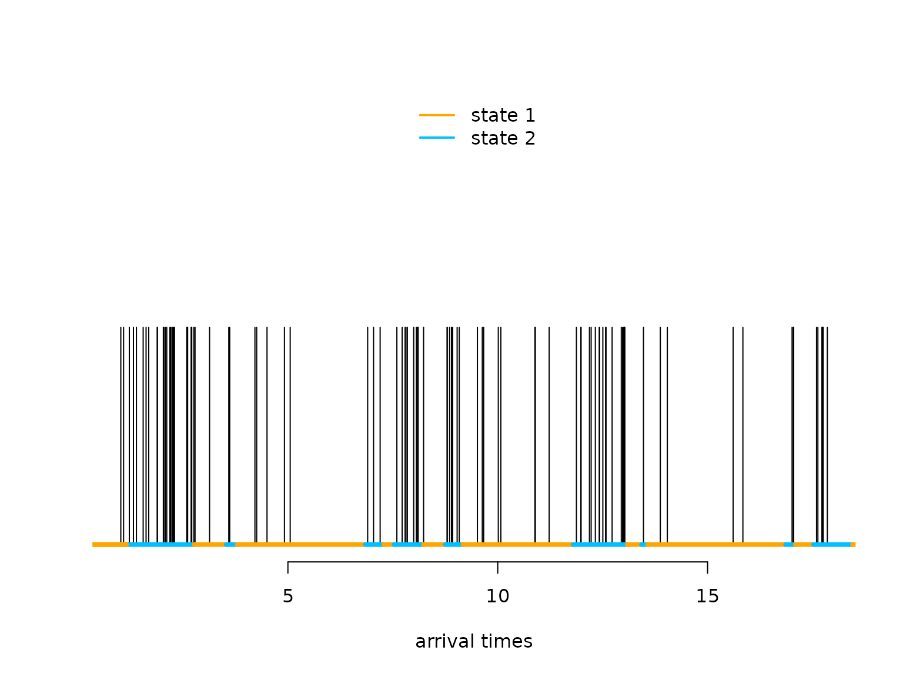
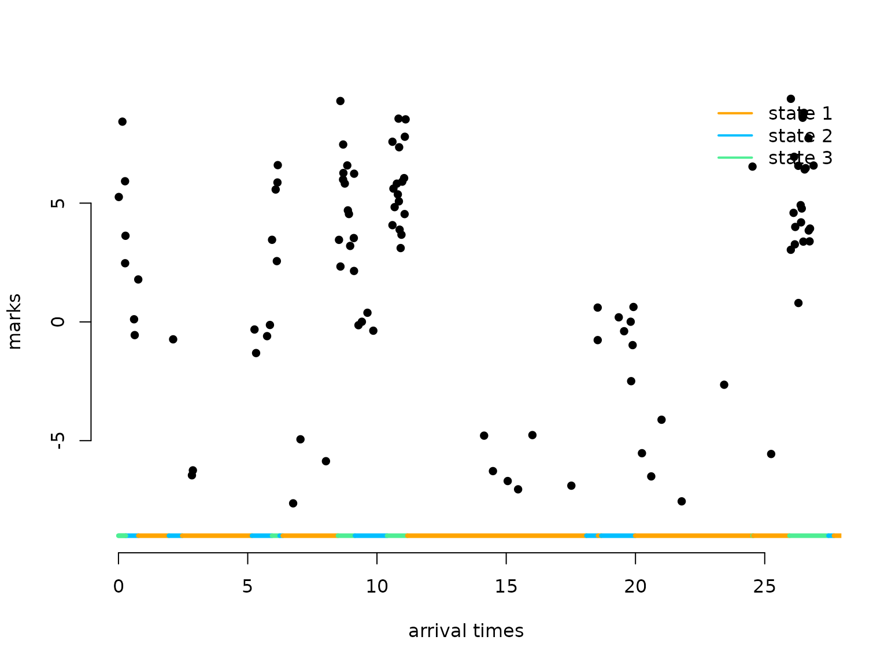

# Markov-modulated (marked) Poisson processes

> Before diving into this vignette, we recommend reading the vignettes
> [**Introduction to
> LaMa**](https://janoleko.github.io/LaMa/articles/Intro_to_LaMa.html)
> and [**Continuous-time
> HMMs**](https://janoleko.github.io/LaMa/articles/Continuous_time_HMMs.html).

`LaMa` can also be used to fit so-called **Markov-modulated Poisson
processes**. These are doubly stochastic Poisson point processes where
the intensity is directed by an underlying continuous-time Markov chain.
Such processes are useful for modelling **arrival times**, for example
of calls in a call center, or patients in the hospital. The main
difference compared to continuous-time HMMs is the arrival or
observation **times** themselves **carry information** on the **latent
state process**. To capture this information, we need to model them
explicitely as random-variables.

A homogeneous Poisson process is mainly characterised by the fact that
the **number of arrivals** within a fixed time interval is **Poisson
distributed** with a mean that is proporional to the length of the
interval. The **waiting times** between arrivals are **exponentially
distributed**. While the latter is not true for non-homogeneous Poisson
processes in general, we can interpret a Markov modulated Poisson
process as **alternating** between homogeneous Poisson processes,
i.e. when the unobserved continuous-time Markov chain stays in a
particular state for some interval, the associated Poisson rate in that
interval is homogeneous and state-specific. To learn more about Poisson
processes, see Dobrow ([2016](#ref-dobrow2016introduction)).

## Example 1: Markov-modulated Poisson processes

``` r
# loading the package
library(LaMa)
#> Loading required package: RTMB
```

### Setting parameters

We choose to have a considerably higher rate and shorter stays of the
underlying Markov chain in state 2, i.e. state 2 is **bursty**.

``` r
# state-dependent rates
lambda = c(2, 15)
# generator matrix of the underlying Markov chain
Q = matrix(c(-0.5,0.5,2,-2), nrow = 2, byrow = TRUE)
```

### Simulating an MMPP

``` r
set.seed(123)

k = 200 # number of state switches
trans_times = s = rep(NA, k) # time points where the chain transitions
s[1] = sample(1:2, 1) # initial distribuion c(0.5, 0.5)
# exponentially distributed waiting times
trans_times[1] = rexp(1, -Q[s[1],s[1]])
# in a fixed interval, the number of arrivals is Pois(lambda * interval_length)
n_arrivals = rpois(1, lambda[s[1]]*trans_times[1]) 
# arrival times within fixed interval are uniformly distributed
arrival_times = runif(n_arrivals, 0, trans_times[1])
for(t in 2:k){
  s[t] = c(1,2)[-s[t-1]] # for 2-states, always a state swith when transitioning
  # exponentially distributed waiting times
  trans_times[t] = trans_times[t-1] + rexp(1, -Q[s[t], s[t]])
  # in a fixed interval, the number of arrivals is Pois(lambda * interval_length)
  n_arrivals = rpois(1, lambda[s[t]]*(trans_times[t]-trans_times[t-1]))
  # arrival times within fixed interval are uniformly distributed
  arrival_times = c(arrival_times, 
                    runif(n_arrivals, trans_times[t-1], trans_times[t]))
}
arrival_times = sort(arrival_times)
```

Let’s visualise the simulated MMPP

``` r
n = length(arrival_times)
color = c("orange", "deepskyblue")
plot(arrival_times[1:100], rep(0.5,100), type = "h", bty = "n", ylim = c(0,1), 
     yaxt = "n", xlab = "arrival times", ylab = "")
segments(x0 = c(0,trans_times[1:98]), x1 = trans_times[1:99], 
         y0 = rep(0,100), y1 = rep(0,100), col = color[s[1:99]], lwd = 4)
legend("top", lwd = 2, col = color, legend = c("state 1", "state 2"), box.lwd = 0)
```

 What makes the MMPP special
compared to a regular Poisson point process is its **burstiness** when
the Markov chain is in the second state.

### Writing the negative log-likelihood function

The likelihood of a stationary MMPP for waiting times x_1, \dots, x_n is
(Meier-Hellstern ([1987](#ref-meier1987fitting)), Langrock, Borchers,
and Skaug ([2013](#ref-langrock2013markov))) L(\theta) = \pi
\Bigl(\prod\_{i=1}^n \exp\bigl((Q-\Lambda)x_i\bigr)\Lambda \Bigr)1,
where Q is the generator matrix of the continuous-time Markov chain,
\Lambda is a diagonal matrix of state-dependent Poisson intensities, \pi
is the stationary distribution of the continuous-time Markov chain, and
1 is a column vector of ones. For more details on continuous-time Markov
chains, see the vignette *continuous-time HMMs* or also Dobrow
([2016](#ref-dobrow2016introduction)).

We can easily calculate the log of the above expression using the
standard implementation of the general forward algorithm
[`forward_g()`](https://janoleko.github.io/reference/forward_g.md) when
choosing the first matrix of state-dependent densities to be the
identity (i.e.) the first row of the `allprobs` matrix to be one and all
other matrices of state-dependent density matrices to be \Lambda.

``` r
nll = function(par, timediff, N){
  lambda = exp(par[1:N]) # state specific rates
  Q = generator(par[N+1:(N*(N-1))])
  Pi = stationary_cont(Q)
  Qube = tpm_cont(Q - diag(lambda), timediff) # exp((Q-Lambda) * dt)
  allprobs = matrix(lambda, nrow = length(timediff + 1), ncol = N, byrow = T)
  allprobs[1,] = 1
  -forward_g(Pi, Qube, allprobs)
}
```

### Fitting an MMPP to the data

``` r
par = log(c(2, 15, # lambda
            2, 0.5)) # off-diagonals of Q

timediff = diff(arrival_times)

system.time(
  mod <- nlm(nll, par, timediff = timediff, N = 2, stepmax = 10)
)
#>    user  system elapsed 
#>   0.337   0.240   0.293
# we often need the stepmax, as the matrix exponential can be numerically unstable
```

### Results

``` r
(lambda = exp(mod$estimate[1:2]))
#> [1]  1.949689 15.083121
(Q = generator(mod$estimate[3:4]))
#>            S1         S2
#> S1 -0.4003954  0.4003954
#> S2  1.8998847 -1.8998847
(Pi = stationary_cont(Q))
#>        S1        S2 
#> 0.8259362 0.1740638
```

## Example 2: Markov-modulated marked Poisson processes

Such processes can also carry additional information, so called
**marks**, at every arrival time when we also observe the realisation of
a different random variable that only depends on the underlying states
of the continuous-time Markov chain. For example for patient arrivals in
the hospital we could observe a biomarker at every arrival time.
**Information** on the **underlying health status** is then present in
both the **arrival times** (because sick patients visit more often) and
the **biomarkers**.

``` r
# state-dependent rates
lambda = c(1, 5, 20)
# generator matrix of the underlying Markov chain
Q = matrix(c(-0.5, 0.3, 0.2,
             0.7, -1, 0.3,
             1, 1, -2), nrow = 3, byrow = TRUE)
# parmeters for distributions of state-dependent marks
# (here normally distributed)
mu = c(-5, 0, 5)
sigma = c(2, 1, 2)

color = c("orange", "deepskyblue", "seagreen2")
curve(dnorm(x, 0, 1), xlim = c(-10,10), bty = "n", lwd = 2, col = color[2], 
      n = 200, ylab = "density", xlab = "mark")
curve(dnorm(x, -5, 2), add = TRUE, lwd = 2, col = color[1], n = 200)
curve(dnorm(x, 5, 2), add = TRUE, lwd = 2, col = color[3], n = 200)
```


### Simulating an MMMPP

We now show how to simulate an MMMPP and additionally how to generalise
to more than two hidden states.

``` r
set.seed(123)
k = 200 # number of state switches
trans_times = s = rep(NA, k) # time points where the chain transitions
s[1] = sample(1:3, 1) # initial distribuion uniformly
# exponentially distributed waiting times
trans_times[1] = rexp(1, -Q[s[1],s[1]])
# in a fixed interval, the number of arrivals is Pois(lambda * interval_length)
n_arrivals = rpois(1, lambda[s[1]]*trans_times[1]) 
# arrival times within fixed interval are uniformly distributed
arrival_times = runif(n_arrivals, 0, trans_times[1])
# marks are iid in interval, given underlying state
marks = rnorm(n_arrivals, mu[s[1]], sigma[s[1]])

for(t in 2:k){
  # off-diagonal elements of the s[t-1] row of Q divided by the diagonal element
  # give the probabilites of the next state
  s[t] = sample(c(1:3)[-s[t-1]], 1, prob = Q[s[t-1],-s[t-1]]/-Q[s[t-1],s[t-1]])
  # exponentially distributed waiting times
  trans_times[t] = trans_times[t-1] + rexp(1, -Q[s[t],s[t]])
  # in a fixed interval, the number of arrivals is Pois(lambda * interval_length)
  n_arrivals = rpois(1, lambda[s[t]]*(trans_times[t]-trans_times[t-1]))
  # arrival times within fixed interval are uniformly distributed
  arrival_times = c(arrival_times, 
                    runif(n_arrivals, trans_times[t-1], trans_times[t]))
  # marks are iid in interval, given underlying state
  marks = c(marks, rnorm(n_arrivals, mu[s[t]], sigma[s[t]]))
}
arrival_times = sort(arrival_times)
```

Let’s visualise the simulated MM**M**PP

``` r
n = length(arrival_times)
plot(arrival_times[1:100], marks[1:100], pch = 16, bty = "n", 
     ylim = c(-9,9), xlab = "arrival times", ylab = "marks")
segments(x0 = c(0,trans_times[1:98]), x1 = trans_times[1:99], 
         y0 = rep(-9,100), y1 = rep(-9,100), col = color[s[1:99]], lwd = 4)
legend("topright", lwd = 2, col = color, 
       legend = c("state 1", "state 2", "state 3"), box.lwd = 0)
```



### Writing the negative log-likelihood function

The likelihood of a stationary MM**M**PP for waiting times x_1, \dots,
x_n between marks y_0, y_1, \dotsc, y_n only changes slightly from the
MMPP likelihood, as we include the matrix of state-specific densities
(Lu ([2012](#ref-lu2012markov)), Mews et al.
([2023](#ref-mews2023markov))): L(\theta) = \pi P(y_0)
\Bigl(\prod\_{i=1}^n \exp\bigl((Q-\Lambda) x_i\bigr)\Lambda P(y_i)
\Bigr)1, where Q, \Lambda and \pi are as above and P(y_i) is a diagonal
matrix with state-dependent densites for the observation at time t_i. We
can again easily calculate the log of the above expression using the
standard implementation of the general forward algorithm
[`forward_g()`](https://janoleko.github.io/reference/forward_g.md) when
first calculating the `allprobs` matrix with state-dependent densities
for the marks (as usual for HMMs) and then multiplying each row except
the first one element-wise with the state-dependent rates.

``` r
nllMark = function(par, y, timediff, N){
  lambda = exp(par[1:N]) # state specific rates
  mu = par[N+1:N]
  sigma = exp(par[2*N+1:N])
  Q = generator(par[3*N+1:(N*(N-1))])
  Pi = stationary_cont(Q)
  Qube = tpm_cont(Q-diag(lambda), timediff) # exp((Q-Lambda)*deltat)
  allprobs = matrix(1, length(y), N)
  for(j in 1:N) allprobs[,j] = dnorm(y, mu[j], sigma[j])
  allprobs[-1,] = allprobs[-1,] * matrix(lambda, length(y) - 1, N, byrow = T)
  -forward_g(Pi, Qube, allprobs)
}
```

### Fitting an MM**M**PP to the data

``` r
par = c(loglambda = log(c(1, 5, 20)), # lambda
        mu = c(-5, 0, 5), # mu
        logsigma = log(c(2, 1, 2)), # sigma
        qs = log(c(0.7, 1, 0.3, 1, 0.2, 0.3))) # Q
timediff = diff(arrival_times)

system.time(
  mod2 <- nlm(nllMark, par, y = marks, timediff = timediff, N = 3, stepmax = 5)
)
#>    user  system elapsed 
#>   4.201   4.574   2.937
```

### Results

``` r
N = 3
(lambda = exp(mod2$estimate[1:N]))
#> [1]  0.9646715  4.8640549 19.5008965
(mu = mod2$estimate[N+1:N])
#> [1] -5.18540508 -0.09097056  4.80538783
(sigma = exp(mod2$estimate[2*N+1:N]))
#> [1] 1.7931062 0.9644486 2.0093266
(Q = generator(mod2$estimate[3*N+1:(N*(N-1))]))
#>            S1         S2         S3
#> S1 -0.5909290  0.2788642  0.3120648
#> S2  0.9258937 -1.1798376  0.2539439
#> S3  1.1933696  1.2097185 -2.4030882
(Pi = stationary_cont(Q))
#>        S1        S2        S3 
#> 0.6296990 0.2609524 0.1093485
```

## References

Dobrow, Robert P. 2016. *Introduction to Stochastic Processes with r*.
John Wiley & Sons.

Langrock, Roland, David L Borchers, and Hans J Skaug. 2013.
“Markov-Modulated Nonhomogeneous Poisson Processes for Modeling
Detections in Surveys of Marine Mammal Abundance.” *Journal of the
American Statistical Association* 108 (503): 840–51.

Lu, Shaochuan. 2012. “Markov Modulated Poisson Process Associated with
State-Dependent Marks and Its Applications to the Deep Earthquakes.”
*Annals of the Institute of Statistical Mathematics* 64: 87–106.

Meier-Hellstern, Kathleen S. 1987. “A Fitting Algorithm for
Markov-Modulated Poisson Processes Having Two Arrival Rates.” *European
Journal of Operational Research* 29 (3): 370–77.

Mews, Sina, Bastian Surmann, Lena Hasemann, and Svenja Elkenkamp. 2023.
“Markov-Modulated Marked Poisson Processes for Modeling Disease Dynamics
Based on Medical Claims Data.” *Statistics in Medicine*.
