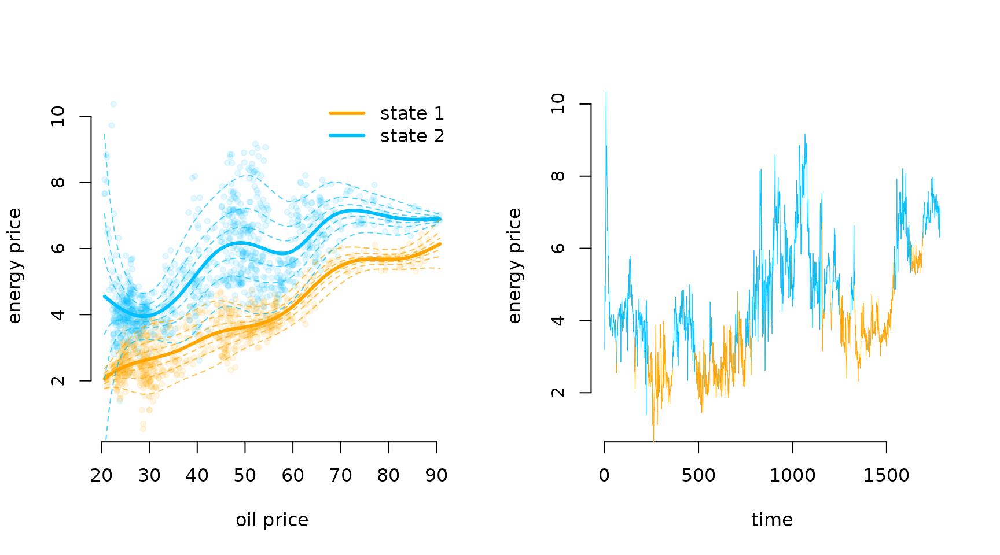

# Penalised splines

> Before diving into this vignette, we recommend reading the vignettes
> **Introduction to LaMa**, **Inhomogeneous HMMs**, **Periodic HMMs**
> and **LaMa and RTMB**.

This vignette explores how `LaMa` can be used to fit models involving
nonparameteric components, represented by **penalised splines**. The
main idea here is that it may be useful to represent some relationships
in our model by smooth functions for which the functional form is not
pre-specified, but flexibly estimated from the data. For HMM-like
models, this is particularly valuable, as the latent nature of the state
process makes modelling choices more difficult. For example, choosing an
appropriate parametric family for the state-dependent distributions may
be difficult as we cannot do state-specific EDA before fitting the
model. Also very difficult is the dependence of transition probabilities
on covariates as the transitions are not directly observed. Hence, the
obvious alternative is to model these kind of relationships flexibly
using splines but imposing a penalty on the smoothness of the estimated
functions. This leads us to **penalised splines**.

`LaMa` contains helper functions that build **design** and **penalty
matrices** for given formulas (using `mgcv` under the hood) and also
functions to estimate models involving penalised splines in a random
effects framework. For the latter to work, the **penalised negative
log-likelihood** needs to be compatible with the R package `RTMB` to
allow for **automatic differentiation (AD)**. For more information on
`RTMB`, see the vignette *LaMa and RTMB* or check out its
[documentation](https://CRAN.R-project.org/package=RTMB). For more
information on penalised splines, we recommend Wood
([2017](#ref-wood2017generalized)).

### Smooth transition probabilites

We will start by investigating a 2-state HMM for the `trex` data set,
containing hourly step lengths and turning angles of a Tyrannosaurus rex
living 66 million years ago. The transition probabilities are modelled
as smooth functions of the time of day using **cyclic P-Splines**. The
relationship can be summarised as

\text{logit}(\gamma\_{ij}^{(t)}) = \beta_0^{(ij)} + s\_{ij}(t), where
s\_{ij}(t) is a smooth periodic function of time of day. We model the
T-rex’s **step lengths** and **turning angles** using state-dependent
**gamma** and **von Mises** distributions.

To ease with model specification, `LaMa` provides the function
[`make_matrices()`](https://janoleko.github.io/reference/make_matrices.md)
which creates **design** and **penalty** matrices for regression
settings based on the R package `mgcv`. The user only needs to specify
the right side of a formula using `mgcv` syntax and provide data. Here,
we use `s(tod, by = "cp")` to create the matrices for cyclic P-splines
(`cp`). This results in a cubic B-Spline basis, that is wrapped at
boundary of the support (0 and 24). We then append both resulting
matrices to the `dat` list.

``` r
library(LaMa)
#> Loading required package: RTMB

head(trex)
#>   tod      step     angle state
#> 1   9 0.3252437        NA     1
#> 2  10 0.2458265  2.234562     1
#> 3  11 0.2173252 -2.262418     1
#> 4  12 0.5114665 -2.958732     1
#> 5  13 0.3828494  1.811840     1
#> 6  14 0.4220099  1.834668     1
```

``` r
modmat = make_matrices(~ s(tod, bs = "cp"), # formula
                       data = data.frame(tod = 1:24), # data
                       knots = list(tod = c(0, 24))) # where to wrap the cyclic basis
Z = modmat$Z # spline design matrix
S = modmat$S # penalty matrix
```

We can now specify the **penalised negative log-likelihood function**.
The transition probability matrix can be computed the regular way using
[`tpm_g()`](https://janoleko.github.io/reference/tpm_g.md). In the last
line we need to add the curvature penalty based on `S`, which we can
conveniently do using
[`penalty()`](https://janoleko.github.io/reference/penalty.md).

``` r
pnll = function(par) {
  getAll(par, dat)
  # cbinding intercept and spline coefs, because intercept is not penalised
  Gamma = tpm_g(Z, cbind(beta0, betaSpline))
  # computing all periodically stationary distributions for easy access later
  Delta = stationary_p(Gamma); REPORT(Delta)
  # parameter transformations
  mu = exp(logmu); REPORT(mu)
  sigma = exp(logsigma); REPORT(sigma)
  kappa = exp(logkappa); REPORT(kappa)
  # calculating all state-dependent densities
  allprobs = matrix(1, nrow = length(step), ncol = N)
  ind = which(!is.na(step) & !is.na(angle)) # only for non-NA obs.
  for(j in 1:N){
    allprobs[ind,j] = dgamma2(step[ind],mu[j],sigma[j]) * dvm(angle[ind],0,kappa[j])
  }
  -forward_g(Delta[tod[1],], Gamma[,,tod], allprobs) + # regular forward algorithm
    penalty(betaSpline, S, lambda) # this does all the penalisation work
}
```

We also have to append a `lambda` vector to our `dat` list which is the
**initial penalty strength** parameter vector. In this case it is of
length two because our coefficient matrix has two rows.

If you are wondering why `lambda` is not added to the `par` list, this
is because for penalised likelihood estimation, it is a
**hyperparameter**, hence not a true parameter in the sense of the other
parameters in `par`. One could, at his point, just use the above
penalised likelihood function to do penalised ML for a **fixed** penalty
strength `lambda`.

``` r
par = list(logmu = log(c(0.3, 2.5)), # state-dependent mean step
           logsigma = log(c(0.2, 1.5)), # state-dependent sd step
           logkappa = log(c(0.2, 1.5)), # state-dependent concentration angle
           beta0 = c(-2, 2), # state process intercepts
           betaSpline = matrix(rep(0, 2*(ncol(Z)-1)), nrow = 2)) # spline coefs

dat = list(step = trex$step, # observed steps
           angle = trex$angle, # observed angle
           N = 2, # number of states
           tod = trex$tod, # time of day (used for indexing)
           Z = Z, # spline design matrix
           S = S, # penalty matrix
           lambda = rep(100, 2)) # initial penalty strength
```

The model fit with automatic smoothness selection can then be conducted
by using the [`qreml()`](https://janoleko.github.io/reference/qreml.md)
function contained in `LaMa`. The **quasi restricted maximum
likelihood** algorithm finds a good penalty strength parameter `lambda`
by treating the spline coefficients as random effects. Under the hood,
[`qreml()`](https://janoleko.github.io/reference/qreml.md) also
constructs an AD function with `RTMB` but uses the **qREML** algorithm
([Koslik 2024](#ref-koslik2024efficient)) to fit the model. We have to
tell the [`qreml()`](https://janoleko.github.io/reference/qreml.md)
function which parameters are spline coefficients by providing the name
of the corresponding list element of `par`.

There are some rules to follow when using
[`qreml()`](https://janoleko.github.io/reference/qreml.md):

1.  The likelihood function needs to be `RTMB`-compatible, i.e. have the
    same structure as the likelihood functions in the vignette *LaMa and
    RTMB*. Most importantly, it should be a function of the parameter
    list only.

2.  The penalty strength vector `lambda` needs its length to correspond
    to the *total* number of spline coefficient vectors used. In our
    case, this is the number of rows of `betaSpline`, but if we
    additionally had a different spline coefficient (with a different
    name) in our parameter list, possibly with a different length and a
    different penalty matrix, we would have needed more elements in
    `lambda`.

3.  The [`penalty()`](https://janoleko.github.io/reference/penalty.md)
    function can only be called *once* in the likelihood. If several
    spline coefficients are penalised,
    [`penalty()`](https://janoleko.github.io/reference/penalty.md)
    expects a list of coefficient matrices or vectors and a list of
    penalty matrices. This is shown in the third example in this
    vignette.

&nbsp;

4.  By default,
    [`qreml()`](https://janoleko.github.io/reference/qreml.md) assumes
    that the penalisation hyperparameter in the `dat` object is called
    `lambda`. You can use a different name for `dat` (of course than
    changing it in your `pnll` as well), but if you want to use a
    different name for the penalisation hyperparameter, you have to
    specify it as a character string in the
    [`qreml()`](https://janoleko.github.io/reference/qreml.md) call
    using the `psname` argument.

``` r
system.time(
  mod1 <- qreml(pnll, par, dat, random = "betaSpline")
)
#> Creating AD function
#> Initialising with lambda: 100 100 
#> outer 1 - lambda: 32.051 31.828 
#> outer 2 - lambda: 10.555 10.748 
#> outer 3 - lambda: 3.659 3.977 
#> outer 4 - lambda: 1.41 1.589 
#> outer 5 - lambda: 0.669 0.693 
#> outer 6 - lambda: 0.426 0.347 
#> outer 7 - lambda: 0.346 0.21 
#> outer 8 - lambda: 0.32 0.153 
#> outer 9 - lambda: 0.312 0.129 
#> outer 10 - lambda: 0.309 0.119 
#> outer 11 - lambda: 0.308 0.114 
#> outer 12 - lambda: 0.308 0.112 
#> outer 13 - lambda: 0.308 0.112 
#> Converged
#> Final model fit with lambda: 0.308 0.112
#>    user  system elapsed 
#>   8.193   3.736   7.655
```

The `mod` object is now a list that contains everything that is reported
by the likelihood function, but also the `RTMB` object created in the
process. After fitting the model, we can use
[`predict()`](https://rdrr.io/r/stats/predict.html) with the `modmat`
object we created earlier to build a new interpolating design matrix
using the exact same basis expansion specified above. This allows us to
plot the estimated transition probabilities as a smooth function of time
of day.

``` r
Delta = mod1$Delta

tod_seq = seq(0, 24, length = 100)
Z_p = predict(modmat, data.frame(tod = tod_seq))

Gamma_plot = tpm_g(Z_p, mod1$beta) # interpolating transition probs

plot(tod_seq, Gamma_plot[1,2,], type = "l", lwd = 2, ylim = c(0,1),
     xlab = "time of day", ylab = "transition probability", bty = "n")
lines(tod_seq, Gamma_plot[2,1,], lwd = 2, lty = 3)
legend("topleft", lwd = 2, lty = c(1,3), bty = "n",
       legend = c(expression(gamma[12]^(t)), expression(gamma[21]^(t))))
```


``` r
plot(Delta[,2], type = "b", lwd = 2, pch = 16, xlab = "time of day", ylab = "Pr(active)", 
     col = "deepskyblue", bty = "n", xaxt = "n")
axis(1, at = seq(0,24,by=4), labels = seq(0,24,by=4))
```


### Smooth density estimation

To demonstrate nonparametric estimation of the state-dependent
densities, we will consider the `nessi` data set. It contains
acceleration data of the Loch Ness Monster, specifically the **overall
dynamic body acceleration (ODBA)**. ODBA is strictily positive with some
very extreme values, making direct analysis difficult. Hence, for our
analysis we consider the logarithm of ODBA as our observed process.

``` r
head(nessi)
#>         ODBA   logODBA state
#> 1 0.03775025 -3.276763     2
#> 2 0.05417830 -2.915475     2
#> 3 0.03625247 -3.317248     2
#> 4 0.01310802 -4.334531     1
#> 5 0.05402441 -2.918319     3
#> 6 0.06133794 -2.791357     3
hist(nessi$logODBA, prob = TRUE, breaks = 50, bor = "white", 
     main = "", xlab = "log(ODBA)")
```


Clearly, there are at least three behavioural states in the data, and we
start by fitting a simple 3-state Gaussian HMM with likelihood function:

``` r
nll = function(par){
    getAll(par, dat)
    sigma = exp(logsigma) # exp because strictly positive
    REPORT(mu); REPORT(sigma)
    Gamma = tpm(eta) # multinomial logit link
    delta = stationary(Gamma) # stationary dist of the homogeneous Markov chain
    allprobs = matrix(1, length(logODBA), N)
    ind = which(!is.na(logODBA))
    for(j in 1:N) allprobs[ind,j] = dnorm(logODBA[ind], mu[j], sigma[j])
    -forward(delta, Gamma, allprobs)
}
```

We then fit the model as explained in the vignette *LaMa and RTMB*.

``` r
# initial parameter list
par = list(mu = c(-4.5, -3.5, -2.5),
           logsigma = log(rep(0.5, 3)),
           eta = rep(-2, 6))

# data and hyperparameters
dat = list(logODBA = nessi$logODBA, N = 3)

# creating automatically differentiable objective function
obj = MakeADFun(nll, par, silent = TRUE)

# fitting the model
opt = nlminb(obj$par, obj$fn, obj$gr)

# reporting to get calculated quantities
mod = obj$report()

# visualising the results
color = c("orange", "deepskyblue", "seagreen3")
hist(nessi$logODBA, prob = TRUE, breaks = 50, bor = "white",
     main = "", xlab = "log(ODBA)")
for(j in 1:3) curve(mod$delta[j] * dnorm(x, mod$mu[j], mod$sigma[j]), 
                    add = TRUE, col = color[j], lwd = 2, n = 500)
```


We see a clear lack-of-fit due to the inflexibility of the Gaussian
state-dependent densities. Thus, we now fit a model with state-dependent
densities based on P-Splines.

In a first step, this requires us to prepare the **design** and
**penalty matrices** needed using
[`smooth_dens_construct()`](https://janoleko.github.io/reference/smooth_dens_construct.md).
This function can take multiple data streams and a set of initial
parameters (specifying initial means and standard deviations) for each
data stream. It then builds the **P-Spline** design and penalty matrices
for each data stream as well as a matrix of **initial spline
coefficients** based on the provided parameters. The basis functions are
standardised such that they integrate to one, which is needed for
density estimation.

``` r
# providing initial means and sds to initialise spline coefficients
par0 = list(logODBA = list(mean = c(-4, -3.3, -2.8), sd = c(0.3, 0.2, 0.5)))

# construct the smooth density objects
modmat = smooth_dens_construct(nessi["logODBA"], # only one data stream here
                               par = par0)
#> logODBA 
#> Leaving out last column of the penalty matrix, fix the last spline coefficient at zero for identifiability!
#> Parameter matrix excludes the last column. Add a (fixed) zero column using 'cbind(coef, 0)' in your loss function!

# par is nested named list: top layer: each data stream
# for each data stream: initial means and standard deviations for each state

# objects for model fitting
Z = modmat$Z$logODBA # spline design matrix for logODBA
S = modmat$S$logODBA # penalty matrix for logODBA
beta = modmat$coef$logODBA # initial spline coefficients

# objects for prediction
Z_p = modmat$Z_predict$logODBA # prediction design matrix
xseq = modmat$xseq$logODBA # prediction sequence of logODBA values
```

Then, we can specify the penalised negative log-likelihood function. The
six lines in the middle are needed for P-Spline-based density
estimation. The coefficient matrix `beta` provided by
`buildSmoothDens()` has one column less than the number of basis
functions, which is also printed when calling `buildSmoothDens()`. This
is because the last column, i.e. the last coefficient for each state,
needs to be fixed to zero for **identifiability** which we do by using
`cbind(beta, 0)`. Then, we transform the unconstrained parameter matrix
to non-negative weights that sum to one (called `alpha`) for each state
using the inverse multinomial logistic link (softmax). The columnns of
the `allprobs` matrix are then computed as linear combinations of the
columns of `Z` and the weights `alpha`. Lastly, we penalise the
unconstrained coefficients `beta` (not the constrained `alpha`’s) using
the [`penalty()`](https://janoleko.github.io/reference/penalty.md)
function.

``` r
pnll = function(par){
  getAll(par, dat)
  # regular stationary HMM stuff
  Gamma = tpm(eta)
  delta = stationary(Gamma)
  # smooth state-dependent densities
  alpha = exp(cbind(beta, 0))
  alpha = alpha / rowSums(alpha) # multinomial logit link
  REPORT(alpha)
  allprobs = matrix(1, nrow(Z), N)
  ind = which(!is.na(Z[,1])) # only for non-NA obs.
  allprobs[ind,] = Z[ind,] %*% t(alpha)
  # forward algorithm + penalty
  -forward(delta, Gamma, allprobs) + 
    penalty(beta, S, lambda)
}
```

Now we specify the initial parameter and data list and fit the model. In
this case, we actually don’t need to add the observations to our `dat`
list anymore, as all the information is contained in the design matrix
`Z`.

``` r
par = list(beta = beta, # spline coefficients prepared by smooth_dens_construct()
           eta = rep(-2, 6)) # initial transition matrix on logit scale

dat = list(N = 3, # number of states
           Z = Z, # spline design matrix
           S = S, # spline penalty matrix
           lambda = rep(10, 3)) # initial penalty strength vector

# fitting the model using qREML
system.time(
  mod2 <- qreml(pnll, par, dat, random = "beta")
)
#> Creating AD function
#> Initialising with lambda: 10 10 10 
#> outer 1 - lambda: 4.213 3.833 4.836 
#> outer 2 - lambda: 2.309 1.937 3.045 
#> outer 3 - lambda: 1.604 1.332 2.338 
#> outer 4 - lambda: 1.305 1.127 2.028 
#> outer 5 - lambda: 1.166 1.053 1.883 
#> outer 6 - lambda: 1.099 1.026 1.812 
#> outer 7 - lambda: 1.065 1.016 1.777 
#> outer 8 - lambda: 1.048 1.012 1.76 
#> outer 9 - lambda: 1.04 1.01 1.75 
#> outer 10 - lambda: 1.035 1.01 1.747 
#> outer 11 - lambda: 1.034 1.01 1.745 
#> outer 12 - lambda: 1.033 1.01 1.745 
#> outer 13 - lambda: 1.033 1.01 1.744 
#> Converged
#> Final model fit with lambda: 1.033 1.01 1.744
#>    user  system elapsed 
#>  15.774   4.411  15.054
```

After fitting the model, we can easily visualise the smooth densities
using the prepared prediction objects. We already have access to all
reported quanitites because
[`qreml()`](https://janoleko.github.io/reference/qreml.md) automatically
runs the reporting after model fitting.

``` r
sDens = Z_p %*% t(mod2$alpha) # all three state-dependent densities on a grid

hist(nessi$logODBA, prob = TRUE, breaks = 50, bor = "white", main = "", xlab = "log(ODBA)")
for(j in 1:3) lines(xseq, mod2$delta[j] * sDens[,j], col = color[j], lwd = 2)
lines(xseq, colSums(mod2$delta * t(sDens)), col = "black", lwd = 2, lty = 2)
```


The P-Spline model results in a very good fit to the empirical
distribution. This is beause the first state has a skewed distribution,
the second state has a high kurtosis and the third state has a funny
right tail. The P-Spline model can capture all of these features where
the parametric model failed to do so.

### Markov-switching GAMLSS

Lastly, we want to demonstrate how one can easily fit Markov-switching
regression models where the state-dependent means and potentially other
parameters depend on covariates via smooth functions. For this, we
consider the `energy` data set contained in the R package `MSwM`. It
comprises 1784 daily observations of energy prices (in Cents per kWh) in
Spain which we want to explain using the daily oil prices (in Euros per
barrel) also provided in the data. Specifically, we consider a 2-state
MS-GAMLSS defined by \text{price}\_t \mid \\ S_t = i \\ \sim N
\bigl(\mu_t^{(i)}, (\sigma_t^{(i)})^2 \bigr), \mu_t^{(i)} =
\beta\_{0,\mu}^{(i)} + s\_{\mu}^{(i)}(\text{oil}\_t), \quad
\text{log}(\sigma_t^{(i)}) = \beta\_{0, \sigma}^{(i)} +
s\_{\sigma}^{(i)}(\text{oil}\_t), \quad i = 1,2, not covering other
potential explanatory covariates for the sake of simplicity.

``` r
data(energy, package = "MSwM")
head(energy)
#>      Price      Oil      Gas     Coal   EurDol Ibex35   Demand
#> 1 3.188083 22.43277 14.40099 38.35157 1.134687 8.3976 477.3856
#> 2 4.953667 22.27263 19.02747 38.35157 1.106439 8.3771 609.1261
#> 3 4.730917 22.65383 18.48417 38.35157 1.106684 8.5547 650.3715
#> 4 4.531000 23.67657 18.30143 38.35157 1.116819 8.4631 647.0499
#> 5 5.141875 23.67209 14.55602 38.35157 1.122965 8.1773 627.9698
#> 6 6.322083 23.60534 15.22485 38.35157 1.122460 8.1866 693.2467
```

Similar to the first example, we can prepare the model matrices using
[`make_matrices()`](https://janoleko.github.io/reference/make_matrices.md):

``` r
modmat = make_matrices(~ s(Oil, k = 12, bs = "ps"), energy)
Z = modmat$Z # design matrix
S = modmat$S # penalty matrix (list)
```

Then, we specify the penalised negative log-likelihood function. It
differs from the first example as the state-dependent distributions, as
opposed to the state process parameters, depend on the covariate.
Additionally, we now have two completely separated spline-coefficient
matrices/ random effects called `betaSpline` and `alphaSpline` for the
state-dependent means and standard deviations respectively. Thus, we
need to pass them as a list to the
[`penalty()`](https://janoleko.github.io/reference/penalty.md) function.

We also pass the penalty matrix list `S` that is provided by
[`make_matrices()`](https://janoleko.github.io/reference/make_matrices.md).
This could potentially be a list of length two if the two spline
coefficient matrices were penalised differently (e.g. by us using a
different spline basis). In this case, however, they are the same and we
only pass the list of length one. It does not matter to
[`penalty()`](https://janoleko.github.io/reference/penalty.md) if we
pass a list of length one or just one matrix.

``` r
pnll = function(par) {
  getAll(par, dat)
  Gamma = tpm(eta) # computing the tpm
  delta = stationary(Gamma) # stationary distribution

  # regression parameters for mean and sd
  beta = cbind(beta0, betaSpline); REPORT(beta) # mean parameter matrix
  alpha = cbind(alpha0, alphaSpline); REPORT(alpha) # sd parameter matrix

  # calculating all covariate-dependent means and sds
  Mu = Z %*% t(beta) # mean
  Sigma = exp(Z %*% t(alpha)) # sd

  allprobs = cbind(dnorm(price, Mu[,1], Sigma[,1]),
                   dnorm(price, Mu[,2], Sigma[,2])) # state-dependent densities
  
  - forward(delta, Gamma, allprobs) +
    penalty(list(betaSpline, alphaSpline), S, lambda)
}
```

From this point on, the model fit is now basically identical to the
previous two examples. We specify initial parameters and include an
inital penalty strength parameter in the `dat` list.

``` r
# initial parameter list
par = list(eta = rep(-4, 2), # state process intercepts
           beta0 = c(2, 5), # state-dependent mean intercepts
           betaSpline = matrix(0, nrow = 2, ncol = 11), # mean spline coef
           alpha0 = c(0, 0), # state-dependent sd intercepts
           alphaSpline = matrix(0, nrow = 2, ncol = 11)) # sd spline coef

# data, model matrices and initial penalty strength
dat = list(price = energy$Price, 
           Z = Z, 
           S = S, 
           lambda = rep(1e3, 4))

# model fit
system.time(
  mod3 <- qreml(pnll, par, dat, random = c("betaSpline", "alphaSpline"))
)
#> Creating AD function
#> Initialising with lambda: 1000 1000 1000 1000 
#> outer 1 - lambda: 466.896 374.247 432.358 329.654 
#> outer 2 - lambda: 250.283 143.698 200.372 113.051 
#> outer 3 - lambda: 126.064 57.828 99.173 42.157 
#> outer 4 - lambda: 72.846 26.191 56.901 18.27 
#> outer 5 - lambda: 48.019 14.491 35.924 9.766 
#> outer 6 - lambda: 35.991 10.081 24.159 6.518 
#> outer 7 - lambda: 29.871 8.365 17.317 5.192 
#> outer 8 - lambda: 26.631 7.684 13.359 4.626 
#> outer 9 - lambda: 24.863 7.41 11.104 4.375 
#> outer 10 - lambda: 23.88 7.297 9.836 4.263 
#> outer 11 - lambda: 23.325 7.25 9.13 4.213 
#> outer 12 - lambda: 23.007 7.23 8.74 4.189 
#> outer 13 - lambda: 22.822 7.22 8.525 4.178 
#> outer 14 - lambda: 22.719 7.216 8.406 4.173 
#> outer 15 - lambda: 22.655 7.214 8.342 4.171 
#> outer 16 - lambda: 22.618 7.213 8.305 4.17 
#> outer 17 - lambda: 22.598 7.213 8.286 4.169 
#> outer 18 - lambda: 22.589 7.212 8.279 4.169 
#> outer 19 - lambda: 22.588 7.212 8.278 4.169 
#> Converged
#> Final model fit with lambda: 22.588 7.212 8.278 4.169
#>    user  system elapsed 
#>  15.261   5.643  14.343
```

Having fitted the model, we can visualise the results. We first decode
the most probable state sequence and then plot the estimated
state-dependent densities as a function of the oil price, as well as the
decoded time series. For the former, we again create a fine grid of oil
price values and use [`predict()`](https://rdrr.io/r/stats/predict.html)
to build the associated interpolating design matrix.

``` r
xseq = seq(min(energy$Oil), max(energy$Oil), length = 200) # sequence for prediction
Z_p = predict(modmat, newdata = data.frame(Oil = xseq)) # prediction design matrix

energy$states = viterbi(mod = mod3) # decoding most probable state sequence

Mu_plot = Z_p %*% t(mod3$beta)
Sigma_plot = exp(Z_p %*% t(mod3$alpha))

library(scales) # to make colors semi-transparent

par(mfrow = c(1,2))

# state-dependent distribution as a function of oil price
plot(energy$Oil, energy$Price, pch = 20, bty = "n", col = alpha(color[energy$states], 0.1),
     xlab = "oil price", ylab = "energy price")
for(j in 1:2) lines(xseq, Mu_plot[,j], col = color[j], lwd = 3) # means
qseq = qnorm(seq(0.5, 0.95, length = 4)) # sequence of quantiles
for(i in qseq){ for(j in 1:2){
  lines(xseq, Mu_plot[,j] + i * Sigma_plot[,j], col = alpha(color[j], 0.7), lty = 2)
  lines(xseq, Mu_plot[,j] - i * Sigma_plot[,j], col = alpha(color[j], 0.7), lty = 2)
}}
legend("topright", bty = "n", legend = paste("state", 1:2), col = color, lwd = 3)

# decoded time series
plot(NA, xlim = c(0, nrow(energy)), ylim = c(1,10), bty = "n",
     xlab = "time", ylab = "energy price")
segments(x0 = 1:(nrow(energy)-1), x1 = 2:nrow(energy),
         y0 = energy$Price[-nrow(energy)], y1 = energy$Price[-1], 
         col = color[energy$states[-1]], lwd = 0.5)
```



## References

Koslik, Jan-Ole. 2024. “Efficient Smoothness Selection for Nonparametric
Markov-Switching Models via Quasi Restricted Maximum Likelihood.”
<https://arxiv.org/abs/2411.11498>.

Wood, Simon. 2017. *Generalized Additive Models: An Introduction with
r*. chapman; hall/CRC.
