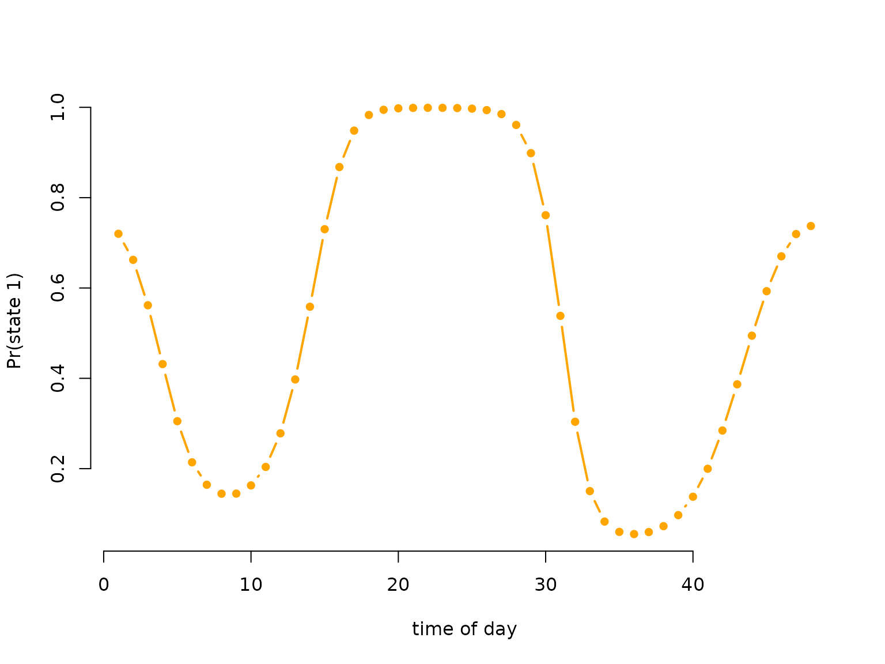
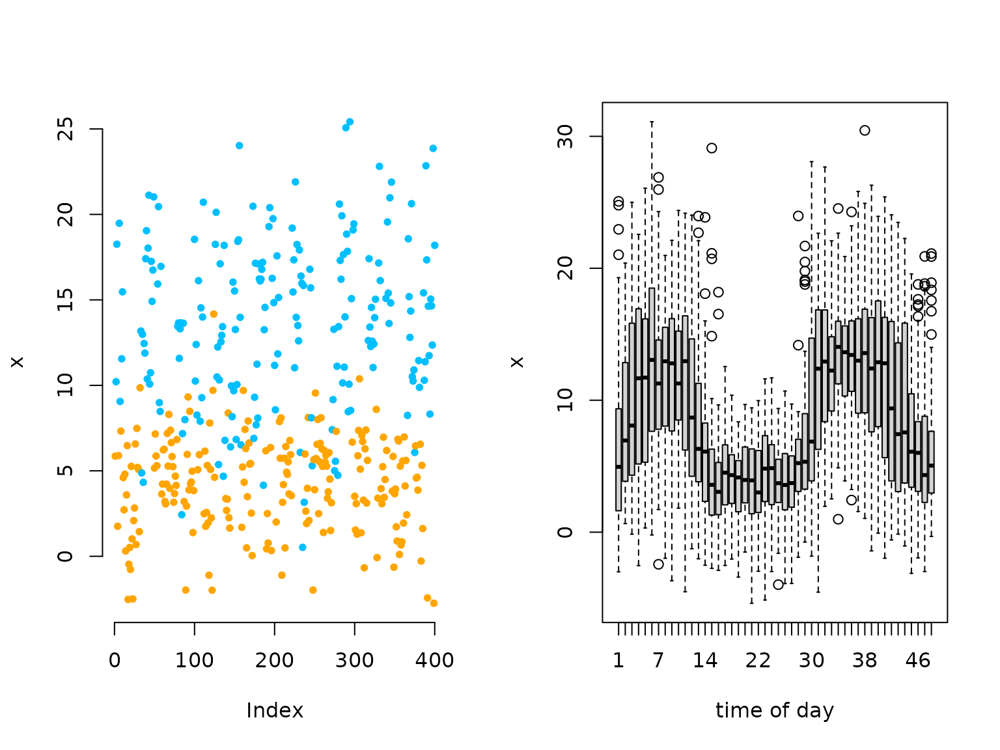

# Periodic HMMs

> Before diving into this vignette, we recommend reading the vignettes
> [**Introduction to
> LaMa**](https://janoleko.github.io/LaMa/articles/Intro_to_LaMa.html)
> and [**Inhomogeneous
> HMMs**](https://janoleko.github.io/LaMa/articles/Inhomogeneous_HMMs.html).

This vignette shows how to fit HMMs where the state process is a
periodically inhomogeneous Markov chain. Formally, this means that for
all t

\Gamma^{(t+L)} = \Gamma^{(t)}, where \Gamma^{(t)} is the transition
probability matrix at time t and L is the cycle length. Such a setting
can conveniently modelled by letting the off-diagonal elements be
trigonometric functions of a cyclic variable such as time of day. While
this model is a special case of the general, inhomogeneous HMM, it is
often more interpretable and very important in statistical ecology,
hence we discuss it separately.

``` r
# loading the package
library(LaMa)
#> Loading required package: RTMB
```

### Setting parameters for simulation

We simulate a 2-state HMM with Gaussian state-dependent distributions.
For the periodic inhomogeneity, we choose a bimodal activity pattern.
All L transition probability matrices can conveniently be calculated
using [`tpm_p()`](https://janoleko.github.io/reference/tpm_p.md). Under
the hood, this performs a basis expansion using
[`trigBasisExp()`](https://janoleko.github.io/reference/trigBasisExp.md)
into sine and cosine terms and uses linear predictos of the form
\eta^{(t)}\_{ij} = \beta_0^{(ij)} + \sum\_{k=1}^K \bigl(
\beta\_{1k}^{(ij)} \sin(\frac{2 \pi k t}{L}) + \beta\_{2k}^{(ij)}
\cos(\frac{2 \pi k t}{L}) \bigr) for the off-diagonal entries of the
transition probability matrix. The special case of periodically
inhomogeneous Markov chains also allows the derivation of a so-called
**periodically stationary distribution** ([Koslik et al.
2023](#ref-koslik2023inference)) which we can compute this distribution
using
[`stationary_p()`](https://janoleko.github.io/reference/stationary_p.md).

``` r
# parameters
mu = c(4, 14)   # state-dependent means
sigma = c(3, 5) # state-dependent standard deviations

L = 48 # half-hourly data: 48 observations per day
beta = matrix(c(-1, 1, -1, -1, 1,
                -2, -1, 2, 2, -2), nrow = 2, byrow = TRUE)
Gamma = tpm_p(seq(1, 48, by = 1), L, beta, degree = 2)
Delta = stationary_p(Gamma)

# having a look at the periodically stationary distribution
color = c("orange", "deepskyblue")
plot(Delta[,1], type = "b", lwd = 2, pch = 16, col = color[1], bty = "n", 
     xlab = "time of day", ylab = "Pr(state 1)")
```



``` r
# only plotting one state, as the other probability is just 1-delta
```

### Simulating data

``` r
# simulation
tod = rep(1:48, 50) # time of day variable, 50 days
n = length(tod)
set.seed(123)
s = rep(NA, n)
s[1] = sample(1:2, 1, prob = Delta[tod[1],]) # initial state from stationary dist
for(t in 2:n){
  # sampling next state conditional on previous one and the periodic t.p.m.
  s[t] = sample(1:2, 1, prob = Gamma[s[t-1],,tod[t]])
}
# sampling observations conditional on the states
x = rnorm(n, mu[s], sigma[s])

oldpar = par(mfrow = c(1,2))
plot(x[1:400], bty = "n", pch = 20, ylab = "x", 
     col = color[s[1:400]])
boxplot(x ~ tod, xlab = "time of day")
```



``` r
# we see a periodic pattern in the data
par(oldpar)
```

## Trigonometric modeling of the transition probalities

### Writing the negative log-likelihood function

We specify the likelihood function and pretend we know the degree of the
trigonometric link which, in practice, is never the case. Again we use
[`tpm_p()`](https://janoleko.github.io/reference/tpm_p.md) and we
compute the periodically stationary start by using
[`stationary_p()`](https://janoleko.github.io/reference/stationary_p.md)
with the additional argument that specifies which time point to compute.

``` r
nll = function(par, x, tod){
  beta = matrix(par[1:10], nrow = 2) # matrix of coefficients
  Gamma = tpm_p(tod = 1:48, L = 48, beta = beta, degree = 2) # calculating all L tpms
  delta = stationary_p(Gamma, t = tod[1]) # periodically stationary start
  mu = par[11:12]
  sigma = exp(par[13:14])
  # calculate all state-dependent probabilities
  allprobs = matrix(1, length(x), 2)
  for(j in 1:2) allprobs[,j] = dnorm(x, mu[j], sigma[j])
  # return negative for minimization
  -forward_p(delta, Gamma, allprobs, tod)
}
```

### Fitting an HMM to the data

``` r
par = c(beta = c(-1,-2, rep(0, 8)), # starting values state process
        mu = c(4, 14), # initial state-dependent means
        logsigma = c(log(3),log(5))) # initial state-dependent sds
system.time(
  mod <- nlm(nll, par, x = x, tod = tod)
)
#>    user  system elapsed 
#>   0.966   0.022   0.988
```

### Visualising results

Again, we use [`tpm_p()`](https://janoleko.github.io/reference/tpm_p.md)
and
[`stationary_p()`](https://janoleko.github.io/reference/stationary_p.md)
to tranform the parameters.

``` r
# transform parameters to working
beta_hat = matrix(mod$estimate[1:10], nrow = 2)
Gamma_hat = tpm_p(tod = 1:48, L = 48, beta = beta_hat, degree = 2)
Delta_hat = stationary_p(Gamma_hat)
mu_hat = mod$estimate[11:12]
sigma_hat = exp(mod$estimate[13:14])

delta_hat = apply(Delta_hat, 2, mean)

oldpar = par(mfrow = c(1,2))
hist(x, prob = TRUE, bor = "white", breaks = 40, main = "")
curve(delta_hat[1]*dnorm(x, mu_hat[1], sigma_hat[1]), add = TRUE, lwd = 2, 
      col = color[1], n=500)
curve(delta_hat[2]*dnorm(x, mu_hat[2], sigma_hat[2]), add = TRUE, lwd = 2, 
      col = color[2], n=500)
curve(delta_hat[1]*dnorm(x, mu_hat[1], sigma_hat[1])+
        delta_hat[2]*dnorm(x, mu[2], sigma_hat[2]),
      add = TRUE, lwd = 2, lty = "dashed", n = 500)
legend("topright", col = c(color[1], color[2], "black"), lwd = 2, bty = "n",
       lty = c(1,1,2), legend = c("state 1", "state 2", "marginal"))

plot(Delta_hat[,1], type = "b", lwd = 2, pch = 16, col = color[1], bty = "n", 
     xlab = "time of day", ylab = "Pr(state 1)")
```


``` r
par(oldpar)
```

## Efficieny and convenience

While it is convenient to use
[`tpm_p()`](https://janoleko.github.io/reference/tpm_p.md), it performs
the basis expansion into sine and cosine terms each time it is
evaluated. This is wasteful in model estimation as these terms stay
fixed. A better alternative is to first build the corresponding design
matrix. This can be done conveniently using the
[`cosinor()`](https://janoleko.github.io/reference/cosinor.md) function,
either by itself or in a formula passed to
[`make_matrices()`](https://janoleko.github.io/reference/make_matrices.md).
First let’s call
[`cosinor()`](https://janoleko.github.io/reference/cosinor.md) by
itself:

``` r
tod = 1:24 # cyclic time of day variable
Z = cosinor(tod, period = c(24, 12)) # design matrix
Z = cbind(intercept = 1, Z)
head(Z, 2)
#>      intercept sin(2*pi*tod/24) cos(2*pi*tod/24) sin(2*pi*tod/12)
#> [1,]         1         0.258819        0.9659258        0.5000000
#> [2,]         1         0.500000        0.8660254        0.8660254
#>      cos(2*pi*tod/12)
#> [1,]        0.8660254
#> [2,]        0.5000000
```

The cosinor function excepts a `period` argument which specifies the
period of the trigonometric functions. As you can see, `period` can be a
vector, leading to a larger basis expansion, i.e. more flexibility. If
your model involves other covariates than time of day, say temperature
(`temp`), it might be more convenient to use
[`make_matrices()`](https://janoleko.github.io/reference/make_matrices.md)
with a formula:

``` r
data = data.frame(tod = rep(1:24, 2), 
                  temp = rnorm(48, 20, 5))
modmat = make_matrices(~ temp * cosinor(tod, 24), data)
Z = modmat$Z
head(Z, 2)
#>      (Intercept)     temp sin(2 * pi * tod/24) cos(2 * pi * tod/24)
#> [1,]           1 18.93188             0.258819            0.9659258
#> [2,]           1 25.98938             0.500000            0.8660254
#>      temp:sin(2 * pi * tod/24) temp:cos(2 * pi * tod/24)
#> [1,]                  4.899932                  18.28680
#> [2,]                 12.994690                  22.50746
```

In both cases, the transition probability matrix can then be calculated
using [`tpm_g()`](https://janoleko.github.io/reference/tpm_g.md) or
[`tpm_p()`](https://janoleko.github.io/reference/tpm_p.md):

``` r
# coefficient matrix
(beta = matrix(c(-2,-2, runif(2*(ncol(Z)-1))), nrow = 2))
#>      [,1]      [,2]      [,3]       [,4]      [,5]      [,6]
#> [1,]   -2 0.5438832 0.3935516 0.75556189 0.8233689 0.7234530
#> [2,]   -2 0.2698139 0.3127479 0.05147858 0.9122313 0.1442263
# constructing t.p.m.s
Gamma = tpm_p(Z = Z, beta = beta) # not first arguments in tpm_p
Gamma = tpm_g(Z, beta) # but first arguments in tpm_g
```

> Continue reading with [**LaMa and
> RTMB**](https://janoleko.github.io/LaMa/articles/LaMa_and_RTMB.html)
> or [**Penalised
> splines**](https://janoleko.github.io/LaMa/articles/Penalised_splines.html).

## References

Koslik, Jan-Ole, Carlina C Feldmann, Sina Mews, Rouven Michels, and
Roland Langrock. 2023. “Inference on the State Process of Periodically
Inhomogeneous Hidden Markov Models for Animal Behavior.” *arXiv Preprint
arXiv:2312.14583*.
